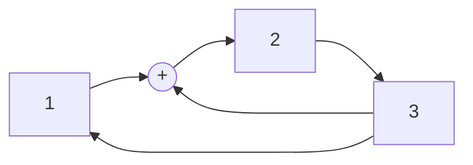

<!-- Macros: start -->
$\newcommand{\block}[2]{\begin{#1} #2 \end{#1}}$
$\newcommand{\cases}[1]{\block{cases}{#1}}$
$\newcommand{\up}[2]{\stackrel{#1}{#2}}$
$\def\dn#1#2{\mathrel{\mathop{#2}\limits_{#1}}}$
$\def\ident{\Longleftrightarrow}$
$\def\thus{\Rightarrow}$
$\newcommand{\set}[1]{ \{ #1 \} }$
$\newcommand{\bigset}[1]{ \left \{ #1 \right \} }$
$\newcommand{\bracs}[1]{ ( #1 ) }$
$\newcommand{\bigbracs}[1]{ \left ( #1 \right ) }$
$\newcommand{\bkets}[1]{\langle #1 \rangle}$
$\newcommand{\bigbkets}[1]{\left \langle #1 \right \rangle}$
$\newcommand{\mat}[1]{\block{Vmatrix}{#1}}$
$\newcommand{\det}[1]{\block{vmatrix}{#1}}$
$\newcommand{\pmat}[1]{\block{pmatrix}{#1}}$
$\newcommand{\emat}[1]{\block{matrix}{#1}}$
$\renewcommand{\geq}{\geqslant}$
$\renewcommand{\leq}{\leqslant}$
$\newcommand{\upline}[1]{\overline{#1}}$
$\newcommand{\dnline}[1]{\underline{#1}}$
$\def\ex{\exists}$
$\def\exo{\ex!}$
$\renewcommand{\phi}{\varphi}$
$\renewcommand{\epsilon}{\varepsilon}$
$\def\alp{\alpha}$
$\def\lam{\lambda}$
$\def\gam{\gamma}$
$\def\eps{\epsilon}$
$\def\sig{\sigma}$
$\newcommand{\NN}{\mathbb{N}}$
$\newcommand{\ZZ}{\mathbb{Z}}$
$\newcommand{\RR}{\mathbb{R}}$
$\newcommand{\CC}{\mathbb{C}}$
$\newcommand{\FF}{\mathbb{F}}$
$\newcommand{\QQ}{\mathbb{Q}}$
$\newcommand{\EE}{\mathbb{E}}$
$\newcommand{\UU}{\mathcal{U}}$
$\newcommand\E{\mathbbold{e}}$
$\newcommand\F{\mathbbold{f}}$
$\newcommand\G{\mathbbold{g}}$
$\renewcommand{\int}{\intop}$
$\def\inf{\infty}$
$\newcommand{\lim}[2]{\dn{{#1}\rightarrow{#2}}{lim}}$
$\newcommand{\ans}[1]{\textbf{Ответ}: #1.}$
$\newcommand{\proj}[2]{\text{пр.}_{#1}{#2}}$
$\newcommand{\norm}[1]{\left \lVert #1 \right \rVert}$
$\newcommand{\ord}[1]{\operatorname{ord}(#1)}$
$\renewcommand{\gcd}{\text{НОД}}$
$\newcommand{\lcm}{\text{НОК}}$
<!-- Macros: end -->
# Проектная Пратика  

## ГПСЧ на РСЛОС  
Генератор псевдо-случайных чисел на Регистрах сдвига с линейно обратной связью (LFSR)  
1) скремблеры и  дескремблеры  
2) помехоустойчивое кодирование  
3) синтез счётчиков  
4) поточные шифры  
5) Кузнечик (блочные шифры)  
...  

$\phi(x) = x^3 +x^2 +1$ - примитивный полином  
если он примитивный, то число состояний в рабочем цикле ПСЧ $2^{n}-1$  
диаграмма переключений - $(2^n-1)-1$  

сложение по модулю 2 - xor  

000  

100  
010  
001  
110  
011  
111  
101  

$\phi (x) = 4x^2 +3x + 2$ примитив полином   
$(p^n-1)-1$  
24-1  
$|\cdot 4$  
$x^2+2x+3$  

генераторы m-1 последовательностей  
$\phi(x) = \lambda(x)(x+1)$ $\lambda(x)$ - приммитивный полином  

$(x^2+x+1)(x+1) = x^3 + 1$  

придумать пятеричный генератор m-1 и потом сделать максимальынй генератор m  

