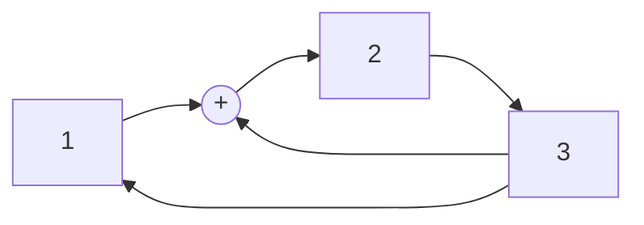

# Проектная Пратика

## ГПСЧ на РСЛОС
Генератор псевдо-случайных чисел на Регистрах сдвига с линейно обратной связью (LFSR)
1) скремблеры и  дескремблеры
2) помехоустойчивое кодирование
3) синтез счётчиков
4) поточные шифры
5) Кузнечик (блочные шифры)
...

$\phi(x) = x^3 +x^2 +1$ - примитивный полином
если он примитивный, то число состояний в рабочем цикле ПСЧ $2^{n}-1$
диаграмма переключений - $(2^n-1)-1$

сложение по модулю 2 - xor

000

100
010
001
110
011
111
101

$\phi (x) = 4x^2 +3x + 2$ примитив полином 
$(p^n-1)-1$
24-1
$|\cdot 4$
$x^2+2x+3$

генераторы m-1 последовательностей
$\phi(x) = \lambda(x)(x+1)$ $\lambda(x)$ - приммитивный полином

$(x^2+x+1)(x+1) = x^3 + 1$

придумать пятеричный генератор m-1 и потом сделать максимальынй генератор m

