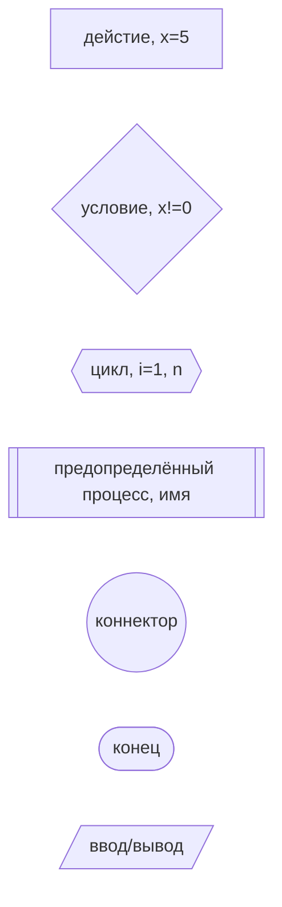
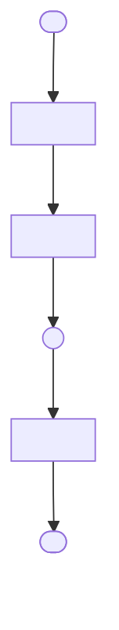
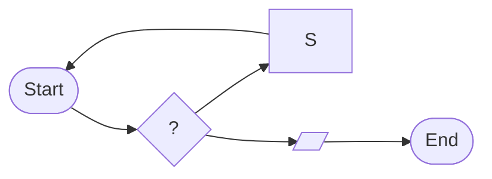
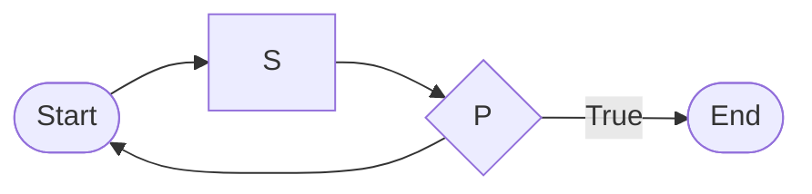
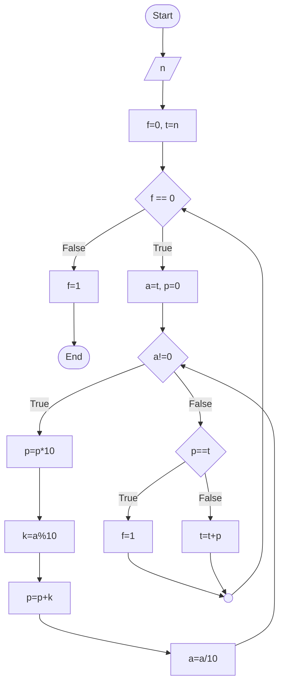
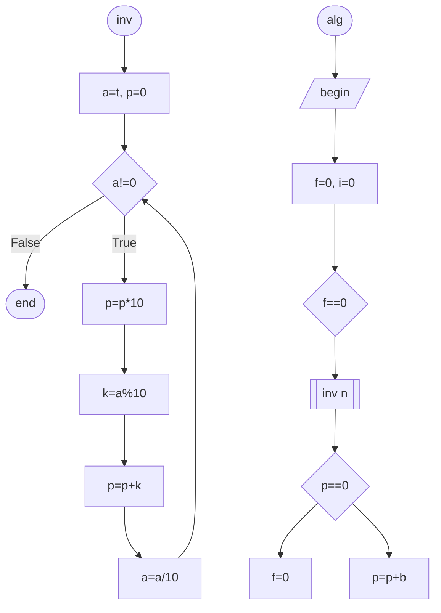

<!-- Macros: start -->
$\def\ident{\Longleftrightarrow}$
$\newcommand{\braket}[1]{\langle #1 \rangle}$
$\newcommand{\block}[2]{\begin{#1} #2 \end{#1}}$
$\newcommand{\cases}[1]{\block{cases}{#1}}$
$\newcommand{\wrapmat}[2]{\block{#1}{#2}}$
$\newcommand{\mat}[1]{\wrapmat{Vmatrix}{#1}}$
$\newcommand{\det}[1]{\wrapmat{vmatrix}{#1}}$
$\newcommand{\pmat}[1]{\wrapmat{pmatrix}{#1}}$
$\newcommand{\upline}[1]{\overline{#1}}$
$\newcommand{\dnline}[1]{\underline{#1}}$

$\usepackage[left=10mm,right=10mm,$
$    top=10mm,bottom=20mm,bindingoffset=0cm]{geometry}$

$%%% Работа с русским языком$
$\usepackage{cmap}                   % поиск в PDF$
$\usepackage{mathtext}               % русские буквы в фомулах$
$\usepackage{indentfirst}            % Отступ первого параграфа$
$\usepackage[T2A]{fontenc}           % кодировка$
$\usepackage[utf8]{inputenc}         % кодировка исходного текста$
$\usepackage[english,russian]{babel} % локализация и переносы$

$%% Кастомизация списокв$
$\usepackage[inline]{enumitem}$

$%%% Дополнительная работа с математикой$
$\usepackage{amsmath,amsfonts,amssymb,amsthm,mathtools} % AMS$
$\usepackage{icomma} % "Умная" запятая: $0,2$ --- число, $0, 2$ --- перечисление$

$%% Номера формул$
$\mathtoolsset{showonlyrefs=true} % Показывать номера только у тех формул, на которые есть \eqref{} в тексте.$

$%% Шрифты$
$\usepackage{euscript} % Шрифт Евклид$
$\usepackage{mathrsfs} % Красивый матшрифт$
$\usepackage[bbgreekl]{mathbbol}$

$%% Табличика там где хочецца$
$\usepackage{float}$

$%% Графички функций$
$\usepackage{pgfplots}$
$\usepackage{tikz}$
$\pgfplotsset{every axis/.style={scale only axis}}$

$%% wrapfigure$
$\usepackage{wrapfig}$


$%% Эпиграф$
$\usepackage{epigraph}$

$\usepackage{fixltx2e}$

$\usepackage{graphicx}$
$\graphicspath{{img/}}$

$\usepackage{blkarray}$

$\usepackage{scalerel}$

$\renewcommand{\kbldelim}{(}$
$\renewcommand{\kbrdelim}{)}$


$%% фигуры$
$\usepackage{import}$
$\usepackage{xifthen}$
$\usepackage{pdfpages}$
$\usepackage{transparent}$


$%% Оглавление с ссылками и ссылки на разные вещи$
$\usepackage[unicode=true, colorlinks=true, linkcolor=blue, urlcolor=blue]{hyperref}$
$\usepackage{nameref}$

$%% Ссылки на пункты description$
$\makeatletter$
$\let\orgdescriptionlabel\descriptionlabel$
$\renewcommand*{\descriptionlabel}[1]{%$
$  \let\orglabel\label$
$  \let\label\@gobble$
$  \phantomsection$
$  \protected@edef\@currentlabel{#1\unskip}%$
$  \let\label\orglabel$
$  \orgdescriptionlabel{#1}%$
$}$
$\makeatother$

$%% Свои команды$
$\DeclareMathOperator{\rk}{\mathop{\mathrm{rk}}}$
$\DeclareMathOperator{\tr}{\mathop{\mathrm{tr}}}$
$\DeclareMathOperator{\pr}{\mathop{\mathrm{pr}}}$
$\DeclareMathOperator{\ort}{\mathop{\mathrm{ort}}}$
$\DeclareMathOperator{\vol}{\mathop{\mathrm{vol}}}$
$\DeclareMathOperator{\Vol}{\mathop{\mathrm{Vol}}}$
$\let\Im\undefined$
$\DeclareMathOperator{\Im}{\mathop{\mathrm{Im}}}$
$\DeclareMathOperator{\sgn}{\mathop{\mathrm{sgn}}}$
$\let\hom\undefined$
$\DeclareMathOperator{\hom}{\mathop{\mathrm{Hom}}}$
$\let\L\undefined$
$\DeclareMathOperator{\L}{\mathop{\mathrm{L}}}$
$\DeclareMathOperator{\diag}{\mathop{\mathrm{diag}}}$
$\DeclareMathOperator{\spec}{\mathop{\mathrm{Spec}}}$
$\DeclareMathOperator{\vht}{\mathop{\mathrm{ht}}}$
$\DeclareMathOperator{\id}{\mathop{\mathrm{Id}}}$

$%% Черный квадрат в доказательствах$
$\renewcommand\qedsymbol{$\blacksquare$}$

$%% Красивые <= и >=$
$\renewcommand{\geq}{\geqslant}$
$\renewcommand{\leq}{\leqslant}$

$%% Более привычные греческие буквы$
$\renewcommand{\phi}{\varphi}$
$\renewcommand{\epsilon}{\varepsilon}$

$%% Перенос знаков в формулах (по Львовскому)$
$\newcommand*{\hm}[1]{#1\nobreak\discretionary{}$
${\hbox{$\mathsurround=0pt #1$}}{}}$

$\newcommand\iso{\xrightarrow{$
$    \,\smash{\raisebox{-0.65ex}{\ensuremath{\scriptstyle\sim}}}\,}}$

$\newcommand{\RomanNumeralCaps}[1]$
$    {\MakeUppercase{\romannumeral #1}}$

$\newenvironment{amatrix}[2]{%$
$    \left(\begin{array}{@{}*{#1}{c}|*{#2}{c}@{}}$
$}{%$
$    \end{array}\right)$
$}$

$%% Сокращения для обозначения множеств$
$\newcommand{\NN}{\mathbb{N}}$
$\newcommand{\ZZ}{\mathbb{Z}}$
$\newcommand{\RR}{\mathbb{R}}$
$\newcommand{\CC}{\mathbb{C}}$
$\newcommand{\FF}{\mathbb{F}}$
$\newcommand{\QQ}{\mathbb{Q}}$
$\newcommand{\EE}{\mathbb{E}}$

$%% Соси жопу, mathbbol, хочу mathbb от amsmath   $
$\DeclareSymbolFontAlphabet{\mathbbold}{bbold}$
$\DeclareSymbolFontAlphabet{\mathbb}{AMSb}$

$%% Жоские буквы для базисов$
$\newcommand\E{\mathbbold{e}}$
$\newcommand\F{\mathbbold{f}}$
$\let\G\undefined$
$\newcommand\G{\mathbbold{g}}$


$%% Изоморфизм$
$\newcommand*\MapsTo{%$
$  \xrightarrow[]{\raisebox{-0.25 em}{\smash{\ensuremath{\sim}}}}%$
$}$

$% Символ делимости (три вертикальные точки)$
$\DeclareRobustCommand{\divby}{%$
$  \mathrel{\text{\vbox{\baselineskip.65ex\lineskiplimit0pt\hbox{.}\hbox{.}\hbox{.}}}}%$
$}$

$\makeatletter$
$\newcommand*\bigcdot{\mathpalette\bigcdot@{.5}}$
$\newcommand*\bigcdot@[2]{\mathbin{\vcenter{\hbox{\scalebox{#2}{$\m@th#1\bullet$}}}}}$
$\makeatother$

$\makeatletter$
$\newcommand{\customlabel}[2]{%$
$   \protected@write \@auxout {}{\string \newlabel {#1}{{#2}{\thepage}{#2}{#1}{}} }%$
$   \hypertarget{#1}{#2}$
$}$
$\makeatother$

$%% Команда для ||w||$
$\DeclarePairedDelimiter\norm{\lVert}{\rVert}%$

$\makeatletter$
$\let\oldnorm\norm$
$\def\norm{\@ifstar{\oldnorm}{\oldnorm*}}$
$\makeatother$

$% Syntax: \colorboxed[<color model>]{<color specification>}{<math formula>}$
$\newcommand*{\colorboxed}{}$
$\def\colorboxed#1#{%$
$  \colorboxedAux{#1}%$
$}$
$\newcommand*{\colorboxedAux}[3]{%$
$  % #1: optional argument for color model$
$  % #2: color specification$
$  % #3: formula$
$  \begingroup$
$    \colorlet{cb@saved}{.}%$
$    \color#1{#2}%$
$    \boxed{%$
$      \color{cb@saved}%$
$      #3%$
$    }%$
$  \endgroup$
$}$
<!-- Macros: end -->

# Информатика

```{contents} Содержание
---
depth: 2
```

Балловая Ирина Филлиповна
Доцент кафедры 12

16 лекций, кажд мес-два 3-х часовые лабы

## Литература

- Кормен Т.Х. и др - Алгоритмы: построение и анализ 3-е изд
- Кенриган Б.У. Ритчи Д.М. - Язык программирования С
- Шили Г.С. - полное руководство, классические издание
- Робачевкий А.М. Немногие С.А. Смески О.Л. - Операционная система UNIX -2-е издание
- Вавренюк А.Б., Кутепов С.В. - Операционные система. Основы UNIX. Учебное пособие
- Вирт Н. - Алгоритмы и структуры данных. Новая верят для Оберон + CD / Перевод с англ
- http://bigor.bmstu.ru/?cnt/?doc=OP2/OP_T.cou
- (доп) Д. Кнут т.1,2,3 - Исскуство программирования.

## ЛЕК 1

Надо научиться:
- Анализировать формулировку задачи
- Определить типы данных для решение задачи на компьютере
- Разрабатывать алгоритм решения поставленной задачи
- Разрабатывать программу на языке программирования в соответствии с созданным аллгоритмом
- Отлаживать решение задачи на достаточном количестве тестов
- Получать правильное решение задачи
- Изучатб язык Си и правила работы в операционной среде Linux

Программа - записанная на языке, понятном для компьютеру, последовательность действий для получения конкретного результата
Алгоритм + структура данных (Орпеледение по Никлаусу Вирту) = программа

Алгоритм - конечное множество правил, определяющее процесс переработки одной, входной системы данных, в другую, выходную, систему данных

Алгоритм:

- Конечный (имеет окончание)
- Дискретный (можно разложить на элементарные действия)
- Однозначный (исполняется при любых условиях, на любом исполнителе)
- Массовость (для любых данных алгоритм работает)

Нет универсального алгоритма!

## СЕМ 1

### Элементы схемы



Правила соединения элементов:
1) все блоки имеют координаты
2) координаты по горизонтали - цифры
3) координаты по вертикали - буквы



### Цикл "пока"



```c
while P do {
	S1;
	S2
}
```
### Цикл "до"



```c
do {
	S1;
	S2
} while P
```

### Алгоритмизация операция с целимыми числами
Число в любой системе счисления - некий многочлен
$X = a_mp^m + a_{m-1}p^{m-1} + \dots + a_0p^0 + a_{-1}p^{-1} + \dots + a_{m-n+1}p^{m-n+1}$
$p$ - основание системы счисления
$m$ - наивысшая степень основании системы счисления в записи числа
$n$ - количество разрядов в записи числа

$\underline{4743}$
$m=3$
$0, \dots, 9$

$395,76 = 3\cdot10^2+9\cdot10^1+5\cdot10^0+7\cdot10^{-1}+6\cdot10^{-2}$

$$x = \sum^{n-1}_{i=0}a_ip^i$$
$$x = \sum^{0}_{i=n-1}a_ip^i =$$
$395 \rightarrow 593$
$3\cdot10^2+9\cdot10^1+5\cdot10^0 = 5\cdot10^2+9\cdot10^1+3\cdot10^0$

Задача: из произвольного целого числа получить палиндромное
$48$
$48 + 84 = 132$
$132 + 231 = 363$



```c
#include <studio.h>

int main() {
	int t, f = 0, p;
	int a, n;

	printf("Введите число n\n");
	scanf("%d", &n);
	t = n;

	while (f == 0) {
		a = t;
		p = 0;
		while (a != 0) {
			p = p * 10;
			k = a % 10;
			p = p + k;
			a = a / 10;
		}
		if (a != k) {
			t = t + p;
		} else {
			f = 1;
		}
	}

	printf("результат\n");
	printf("%10d %10d", n, p);

	return 0;
}
```



```c
#inlcude <studio.h>
int inv( int n ) {
	int t, f = 0, p;
	int a;

	t = n;
	while (f == 0) {
		a = t;
		p = 0;
		int k;
		while (a != 0) {
			p = p * 10;
			k = a % 10;
			p = p + k;
			a = a / 10;
		}
		if (p != t) {
			t = t + p;
		} else {
			f = 1;
		}
	}
	return p;
}

int main() {
	int aa = 1, n;
	printf("Начало!\n");

	printf("Число ...");
	scanf("%d", &n);

	int nepal = inv(n);
	printf("...");
	return 0;
}
```

ДЗ:
- Из заданного числа получить число состоящее только из четных цифр числа
- Из цифр числа составить минимальное число
