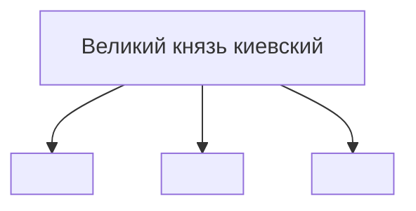
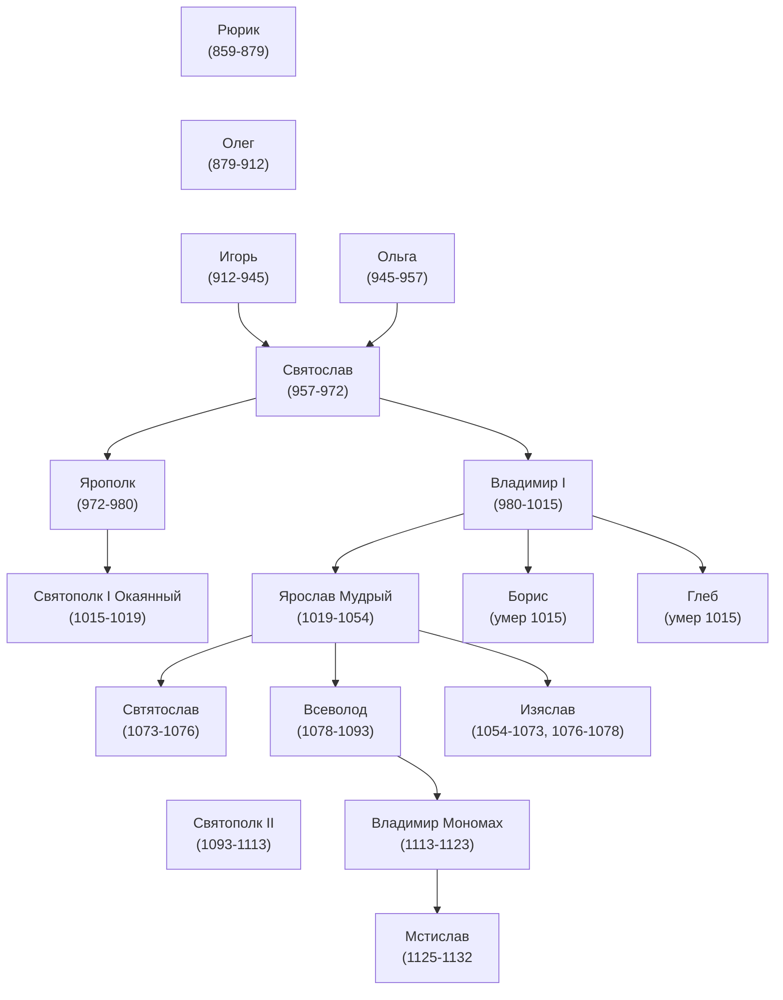

<!-- Macros: start -->
$\newcommand{\block}[2]{\begin{#1} #2 \end{#1}}$
$\newcommand{\cases}[1]{\block{cases}{#1}}$
$\newcommand{\up}[2]{\stackrel{#1}{#2}}$
$\def\dn#1#2{\mathrel{\mathop{#2}\limits_{#1}}}$
$\def\ident{\Longleftrightarrow}$
$\def\thus{\Rightarrow}$
$\newcommand{\set}[1]{ \{ #1 \} }$
$\newcommand{\bigset}[1]{ \left \{ #1 \right \} }$
$\newcommand{\bracs}[1]{ ( #1 ) }$
$\newcommand{\bigbracs}[1]{ \left ( #1 \right ) }$
$\newcommand{\bkets}[1]{\langle #1 \rangle}$
$\newcommand{\bigbkets}[1]{\left \langle #1 \right \rangle}$
$\newcommand{\mat}[1]{\block{Vmatrix}{#1}}$
$\newcommand{\det}[1]{\block{vmatrix}{#1}}$
$\newcommand{\pmat}[1]{\block{pmatrix}{#1}}$
$\newcommand{\emat}[1]{\block{matrix}{#1}}$
$\renewcommand{\geq}{\geqslant}$
$\renewcommand{\leq}{\leqslant}$
$\newcommand{\upline}[1]{\overline{#1}}$
$\newcommand{\dnline}[1]{\underline{#1}}$
$\def\ex{\exists}$
$\def\exo{\ex!}$
$\renewcommand{\fal}{\forall}$
$\renewcommand{\int}{\intop}$
$\def\inf{\infty}$
$\renewcommand{\tg}{\tan}$
$\renewcommand{\phi}{\varphi}$
$\renewcommand{\epsilon}{\varepsilon}$
$\def\alp{\alpha}$
$\def\lam{\lambda}$
$\def\gam{\gamma}$
$\def\eps{\epsilon}$
$\def\sig{\sigma}$
$\newcommand{\NN}{\mathbb{N}}$
$\newcommand{\ZZ}{\mathbb{Z}}$
$\newcommand{\RR}{\mathbb{R}}$
$\newcommand{\CC}{\mathbb{C}}$
$\newcommand{\FF}{\mathbb{F}}$
$\newcommand{\QQ}{\mathbb{Q}}$
$\newcommand{\EE}{\mathbb{E}}$
$\newcommand{\UU}{\mathcal{U}}$
$\newcommand\E{\mathbbold{e}}$
$\newcommand\F{\mathbbold{f}}$
$\newcommand\G{\mathbbold{g}}$
$\newcommand{\rawOlim}[3]{\dn{{#1}\rightarrow{#2}}{#3}}$
$\newcommand{\lim}[2]{\rawOlim{#1}{#2}{lim}}$
$\newcommand{\uplim}[2]{\rawOlim{#1}{#2}{\upline{lim}}}$
$\newcommand{\dnlim}[2]{\rawOlim{#1}{#2}{\dnline{lim}}}$
$\newcommand{\norm}[1]{\left \lVert #1 \right \rVert}$
$\newcommand{\ord}[1]{\operatorname{ord}(#1)}$
$\newcommand{\ans}[1]{\textbf{Ответ}: #1.}$
$\renewcommand{\gcd}{\text{НОД}}$
$\newcommand{\lcm}{\text{НОК}}$
$\newcommand{\proj}[2]{\text{пр.}_{#1}{#2}}$
$\newcommand{\U}[2]{U_{#1}(#2)}$
<!-- Macros: end -->  

# История  

```{contents} Содержание  
---  
depth: 2  
```  

Швец Татьяна Дмитриевна  
Доцент Кафедры 52  

Зачет зимой и весной  
Лекции в Б100  

## Литература  

[Девятов, Македонская, Швец - История России: учебно-методическое пособие для студентов технического университета](https://docs.google.com/gview?url=https://mephi-tex.rtfd.io/ru/latest/_static/literature/Учебное_пособие_История_России_2_версия.pdf)  

## Баллы  

- 90-100 "А"  
- 85-90 "В"  
- 80-85 "С"  
- 60-80 "Е"  
- 0-60 "F"  

## Разбалловка  

- Таблица: 20 баллов  
- Работа в семинаре (подводится в конце каждого семинара): 0-2  
- Доклады + презентации (10 минут): 3  
- Музеи и соц мероприятия (воскр): 5  
- Зачёт (автомат с 60): 50  

## Таблицы  

Основа для подведения итогов  

### Династия рюриковичей  

Правители | Внутренняя политика | Внешняя полтиика  
:-|-|-:  
Рюрик | |  
Олег | |  
Игорь | |  
Ольга | |  
... | |  
Владимир Мономах | |  

## Древняя Русь  

Сём: Тема 1, Вопрос 1,2 (обязательно для подготовки)  
Заносится в таблицу + доклады и задания для самостоятельной работы в конце темы  

Доклады по князьм, не затрагивая религию и вопросы  
Не менее двух докладов на человека  

~ 13 семов  

kaf52.mephi.ru  

## ЛЕК 1  

### ЛЕК 1 Образование в древней руси  
-15 век (до новой эры)  
эволюция словянства  

Западные:  
- Поляки  
- Чехи  
- Словаки  
- Лужицкие сербы  
- Кашубы  

Южные:  
- Болгары  
- Сербы  
- Хорваты  
- Словенцы  
- Черногорцы  
- Боснийцы  
- Македонцы  

Восточные:  
- Русские  
- Украинцы  
- Беларусы  

Предпосылки государственности:  
- Экономическая основа - земледелие с использованием металлических орудий  
- Социальная - территориальная община  
- Военная - дружина во главе с князем  

Влияние природной мсреды и особнности адаптации этноса:  
1) Бескрайность просторов - возможности внутренней колонизации  
2) Отсутствия едстественных границ - уязвимость для агресии извне  
3) Равнинный характер местности - земледелие, осделанность  

Спеть - напасть  

Государственный строй древней руся:  


Династия рюриковичей  


Съезд в любичей 1197
Иван третий прекратил платить дань

<!-- start-private -->
Московские князья
| Кто | Годы правления | Территория/присоединенные земли | Отношения с ордой|
|-|-|-|-|
|Даниил Александрович (сын Александра Невского) | 1283-1303 гг. | Основатель московской княжеской династии. Активно занимался строительством, воевал с Рязанью, успешно завоевал Коломну. Считался мудрейшим князем своего времени.
|Юрий Данилович (сын Даниила Александровича) |1303-1325 гг.| Воевал с Тверским княжеством, активно вел борьбу с нижегородскими князьями, и в итоге завоевал Нижний Новгород. Поддерживал союзнические отношения с монгольскими князьями.|
|Иван Калита (сын Даниила Александровича)| 1325-1340 гг.| Ходил с походами на Смоленск, когда те отказались платить ордынцам дань. Считался одним из самых верующих князей, добился переноса кафедры митрополитов в Москву, что укрепило статус столицы. Подавление антиордынского восстания в Твери.|
|Симеон Гордый |1340-1353 гг.| Конфликтовал с Нижним Новгородов и Литвой. Придерживался союзнических отношений с Золотой Ордой, но рассматривал возможность их скорого свержения.|
|Иван Красный |1353-1359 гг.| Конфликтовал с великим княжеством Литовским, а также с нижегородско-суздальским княжеством. Пытался добиться уменьшения размера дани.
|Дмитрий Донской (сын Ивана Красного, внук Ивана Калиты) |1359-1389 гг.| Выиграл Куликовскую битву и добился освобождения от ордынского правления на пару лет. После нашествия Тохтамыша, Дмитрий Донской сдал свои позиции, и выплаты дани Золотой Орде возобновились.|
|Василий I Дмитриевич (cын Дмитрия Ивановича Донского) |1389-1425 гг.| Выкупил у Золотой Орды право распоряжаться Нижним Новгородом. Конфликтовал с Великим княжеством Литовским, в том числе, принимал участие в стоянии на Угре. Пытался ослабить Ордынское княжество, но безрезультатно. Присоединение к Москве Суздальско-Нижегородского княжества.| 
|Василий II Васильевич Темный (сын Василия I) |1425-1433 гг.| В период его правления началась междоусобная война за власть в Москве, продолжавшаяся до 1453 года. Конфликтовал с Литвой и с Золотой Ордой, понимая, что ордынцы ослабли. Снизил размер выплачиваемой дани.
|Юрий Звенигородский Василий Косой. Дмитрий Шемяка |1434 г. 1434 г. 1446-1447 гг.| Принимали участие в междоусобной войне в Москве, пытались добиться власти, но правили недолго. |
|Иван III Великий (сын Василия II Темного) |1462-1505 гг.| Добился освобождения Руси от Золотой Орды в 1480 году, объединил все земли вокруг Москвы. Вел активную захватническую политику, расширяя территории города. Также занимался строительством, сделав Москву по-настоящему великим городом. 71 год, стояние на угре, общегосударственные ведомства: козна и дворец, государственный герб - двухглавый орёл, строительство московского кремля, называться россией. Судебник. Секуляризация.|
|Василий III Иванович (сын Ивана III) |1505-1533 гг.| Поддерживал иосифлян, издал новый Судебник 1472 г., занимался строительством. Продолжил политику отца по объединению земель. Конфликтовал с Литвой (15007-1508 и 1512-1522 года). Присоединение к Москве Пскова (1510 г.), Смолен­ских земель (1514 г.) и Рязанского княжества (1521 г.). Распад золотой орды 1502 г; |Задачи: выход на торговый общий путь, прекратить постоянные набеги. Псков, Смоленск, Рязань|
|Иван IV Грозный (сын Василия III) |1533-1584 гг. |Ходил на Казань, Астрахань, воевал со Швецией и Ливонским орденом. Стал основателем опричнины. Считался одним из самых жестоких правителей в истории Руси. Реформы Избранной Рады: Судебные (1550 г.), военная реформа, «Стогневный собор» (1551 г.), реформы местного и центрального управления, присоединение к Москве Казанского (1552 г.) и Астраханского (1556 Г.) ханства. Ливонская война (1558-1583 гг.), опричнина (1565-1572 гг.), начало завоевания Сибири Ермаком (1581-1584 гг.). |
|Федор Иоаннович (сын Ивана IV Грозного)| 1584-1598 гг.| Ходил на Казань, Астрахань, воевал со Швецией и Ливонским орденом. Стал основателем опричнины. Считался одним из самых жестоких правителей в истории Руси. Реформы Избранной Рады: Судебные (1550 г.), военная реформа, «Стогневный собор» (1551 г.), реформы местного и центрального управления, присоединение к Москве Казанского (1552 г.) и Астраханского (1556 Г.) ханства. Ливонская война 1558-1583 гг., опричнина 1565-1572 гг., начало завоевания Сибири Ермаком 1581-1584 гг.  |

<!-- end-private -->

когда власть использует жесткость/жестокость, это следствие чего? слабости влясти

Сиондик - список убитых
июль 1572
Воротынский - составитель первого воинсткого устава

Соборное уложение, бунт, раскол церкви
Минус земский собор, минус ... Бюрократия плюс, абсолютная монархия 

Речь посолитая, Дания ...
Деревня лесная
27 июля полтавской битвы
Мыс ганбут
остров гренгам

Нештадтский

Петр третий:
- Манифест .. дворян
- раздача крестьян помещикам
- секуляризация церковных земель
февральские манифесты
легитимный правитель

северная война

27 6 09

мыс ган гут
остров грен ган
инаджийский и ясский


## Сем 13.02.23

Черенков Роман Александрович

В начале пары будет спрашивать
60 баллов - автомат

ДЗ - ответить на вопросы:
1) Реформу и контрреформы Александра I
2) Отечественная война 12-го года (причина, ход - основные события, следствие)


<!--

|Название|Идеология|Основные идеи|
|-|-|-|
|консерватизм|приверженность традиционным ценностям и порядкам, социальным и религиозным доктринам|укрепление самодержавия, поддержка дворянства в качестве опоры, сохранение единой и неделимой россии, господство православия, поощрение русификации, необходимость корректировки реформ 1850-х-70-х в интересах двоорянства|
|либерализм|непоколебимость прав и свобод человека|расширение прав земств и создание центральных представительных учреждений, введение гражданских свобод|
|социализм|реализация социальной справедливости, достижение которой предполагается в том числе через общественную собственность на средства производства|насильственная демократизация социально-политического строя-ликвидация самодержавия|


Общественно-политические течения первой половины XIX в
|Название|Идеология|Основные идеи|
|-|-|-|
|западники|приверженности к западному цивилизованному миру|необходимо следование западному пути, как проверенному временем и ведущему к высокому уровню жизни и наличию свобод|
|декабристы|в основном была направлена против самодержавия и крепостного права||
|Декабристы|Либеральная|Нужно осуществить политические реформы в стране, включая отмену крепостного права и установление конституционного правления.|  
|Западники|Либеральная|Государство должно руководствоваться западными принципами и стараться достичь уровня развития Запада. Важна модернизация экономики и промышленности.|  
|Славянофилы|Консервативная|Россия должна сохранять традиции и культуру, отличающуюся от западной. Важно сохранение церкви и возрождение традиционных ценностей. Отрицание демократии и поощрение автократизма.|

-->


Общественно-политические течения первой половины XIX в
|Название|Идеология|Основные идеи|  
|---|---|---|  
|Декабристы|Смешанная, в основном против самодержавия|Необходимость реформ в России, отмена крепостного права, установление конституционного правления|  
|Западники|Либерализм|Принятие западных идей и принципов в экономике, науке и культуре, необходимость модернизации и развития России|  
|Славянофилы|Консерватизм|Сохранение традиционных ценностей и Российской культуры, отрицание западной цивилизации и демократии, поддержка автократизма|  
|Народники (Популисты)|Левый радикализм|Выступление за свержение крепостной зависимости, реформы в сельском хозяйстве в интересах крестьянского класса, восхищение народа и подготовка него к революции|  
|Нигилисты|Рациональный социализм|Критика капитализма, умеренный либерализм, поддержка социализма|  
|Консерваторы и автократы|Консерватизм|Отрицание потребности в реформах, поддержка сохранения существующей социально-политической системы, абсолютной монархии и автократии|


Револяция 1905-7 года  
| Подъем | Кульминация | Спад |  
| --- | --- | --- |  
| Кровавое воскресенье 9 (22) января 1905 года — расстрел мирной демонстрации рабочих в Санкт-Петербурге¹². Забастовки и протесты в разных городах России. Поражения в русско-японской войне¹. | Вооруженное восстание в Москве 9 (22) — 19 (1) декабря 1905 года¹. Советы рабочих депутатов и крестьянские союзы. Манифест 17 октября 1905 года — обещание царем гражданских свобод и учреждение Государственной Думы¹². | Третьеиюньский переворот 3 (16) июня 1907 года — роспуск II Государственной Думы и изменение избирательного закона¹². Репрессии против революционеров и оппозиционных партий. Умеренно-реакционная политика властей, направленная на проведение наиболее назревших реформ¹. |  


Кризисы временного правительства:

|Кризисы|Причины|Позиция большевиков и петросовета|Основные события|Итоги|
|-|-|-|-|-|
|Апрельский|Массовые демонстрации и требования о прекращении участия в Первой мировой войне, выпуск политических заключенных, свобода слова и прессы.|Большевики и петросовет поддерживали требования масс и призывали к переходу к социалистической революции.|Правительство временного правительства отказалось удовлетворить требования масс, что привело к усилению революционной агитации.|В результате апрельского кризиса произошли массовые забастовки и волнения, которые были подавлены временным правительством.|
|Июльский|Ухудшение экономического положения населения, продолжающаяся Первая мировая война, поражение русских войск на фронтах, провал наступления на Венгрию.|Большевики и петросовет критиковали временное правительство за продолжение участия в войне и неспособность решить социально-экономические проблемы.|Массовые демонстрации и волнения, которые были подавлены правительством временного правительства.|В результате июльского кризиса были закрыты большевистские газеты и организации, а также были арестованы лидеры большевиков, включая Владимира Ленина.|
|Июньский|Усиление революционного движения, критика временного правительства за неспособность решать социально-экономические проблемы, провал Керенского в борьбе с Корниловским мятежом.|Большевики и петросовет призывали к переходу к социалистической революции и критиковали временное правительство.|Массовые демонстрации и забастовки, которые были подавлены правительством временного правительства.|В результате июньского кризиса усилилось революционное движение, а позиция большевиков и петросовета стала более сильной и влиятельной. Это также привело к тому, что временное правительство стало более неустойчивым и слабым.|
|Корниловский мятеж|Попытка генерала Корнилова и его сторонников захватить власть в стране.|Большевики и петросовет поддерживали временное правительство в борьбе с мятежом и призывали к укреплению революции.|Войска Корнилова начали наступление на Петроград, но были разгромлены войсками временного правительства.|В результате Корниловского мятежа временное правительство укрепилось и усилилась его позиция, а большевики получили большую популярность и влияние.|


Инустриализация, коллективизация

|Цели и задачи|Этапы|Особенности|Итоги|
|-|-|-|-|
|||||


