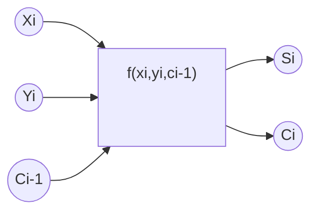
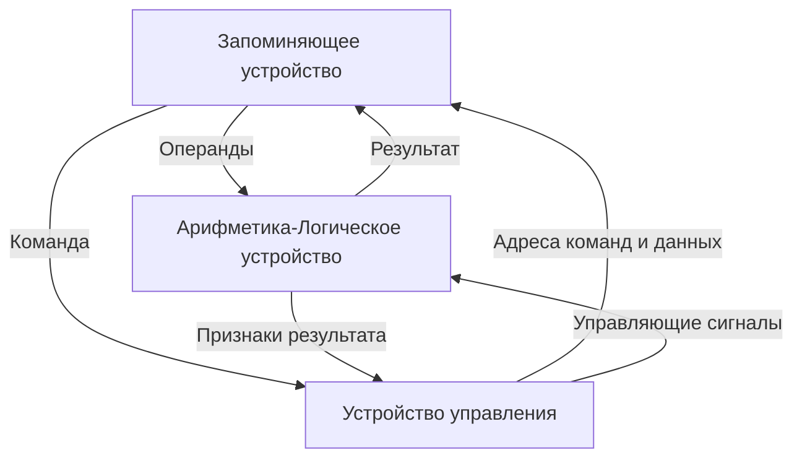

<!-- Macros: start -->
$\newcommand{\block}[2]{\begin{#1} #2 \end{#1}}$
$\newcommand{\cases}[1]{\block{cases}{#1}}$
$\newcommand{\up}[2]{\stackrel{#1}{#2}}$
$\def\dn#1#2{\mathrel{\mathop{#2}\limits_{#1}}}$
$\def\ident{\Longleftrightarrow}$
$\def\thus{\Rightarrow}$
$\newcommand{\set}[1]{ \{ #1 \} }$
$\newcommand{\bigset}[1]{ \left \{ #1 \right \} }$
$\newcommand{\bracs}[1]{ ( #1 ) }$
$\newcommand{\bigbracs}[1]{ \left ( #1 \right ) }$
$\newcommand{\bkets}[1]{\langle #1 \rangle}$
$\newcommand{\bigbkets}[1]{\left \langle #1 \right \rangle}$
$\newcommand{\mat}[1]{\block{Vmatrix}{#1}}$
$\newcommand{\det}[1]{\block{vmatrix}{#1}}$
$\newcommand{\pmat}[1]{\block{pmatrix}{#1}}$
$\newcommand{\emat}[1]{\block{matrix}{#1}}$
$\renewcommand{\geq}{\geqslant}$
$\renewcommand{\leq}{\leqslant}$
$\newcommand{\upline}[1]{\overline{#1}}$
$\newcommand{\dnline}[1]{\underline{#1}}$
$\def\ex{\exists}$
$\def\exo{\ex!}$
$\renewcommand{\fal}{\forall}$
$\renewcommand{\int}{\intop}$
$\def\inf{\infty}$
$\renewcommand{\tg}{\tan}$
$\renewcommand{\phi}{\varphi}$
$\renewcommand{\epsilon}{\varepsilon}$
$\def\alp{\alpha}$
$\def\lam{\lambda}$
$\def\gam{\gamma}$
$\def\eps{\epsilon}$
$\def\sig{\sigma}$
$\newcommand{\NN}{\mathbb{N}}$
$\newcommand{\ZZ}{\mathbb{Z}}$
$\newcommand{\RR}{\mathbb{R}}$
$\newcommand{\CC}{\mathbb{C}}$
$\newcommand{\FF}{\mathbb{F}}$
$\newcommand{\QQ}{\mathbb{Q}}$
$\newcommand{\EE}{\mathbb{E}}$
$\newcommand{\UU}{\mathcal{U}}$
$\newcommand\E{\mathbbold{e}}$
$\newcommand\F{\mathbbold{f}}$
$\newcommand\G{\mathbbold{g}}$
$\newcommand{\rawOlim}[3]{\dn{{#1}\rightarrow{#2}}{#3}}$
$\newcommand{\lim}[2]{\rawOlim{#1}{#2}{lim}}$
$\newcommand{\uplim}[2]{\rawOlim{#1}{#2}{\upline{lim}}}$
$\newcommand{\dnlim}[2]{\rawOlim{#1}{#2}{\dnline{lim}}}$
$\newcommand{\norm}[1]{\left \lVert #1 \right \rVert}$
$\newcommand{\ord}[1]{\operatorname{ord}(#1)}$
$\newcommand{\ans}[1]{\textbf{Ответ}: #1.}$
$\renewcommand{\gcd}{\text{НОД}}$
$\newcommand{\lcm}{\text{НОК}}$
$\newcommand{\proj}[2]{\text{пр.}_{#1}{#2}}$
$\newcommand{\U}[2]{U_{#1}(#2)}$
<!-- Macros: end -->  

# ЭВМ и Периферийные Устройства  

```{contents} Содержание  
---  
depth: 2  
```  

Кузьминова Алла Владимирована  

Новиков Григорий Григорьевич, доцент кафедры 12  

Структура курса: теория, потом практика  

Межсемистровый контроль на 8 неделе  

Любая "Н"ка подкрепляется бумажкой  

Стоит слушать лекции Новикова Григория Григорьевича  

## Разбалловка  

- 20 баллов за 1 - 8 работ  
- 30 за 9 - 16 работы  
штраф за несвоевременность сдачи  

## Литература  

- Электронные версии http://dozen.mephi.ru/student/liter.him (htm?)  
- Канал Б.М. - электронные вычислительные машины и системы  
- В.В. Гуров - Основы теории и организации ЭВМ  
- Поспелов Д.А. - логические методы анализа и синтеза схем  
- Савельев А.Я. - Прикладная теория цифровых автоматов  
- Соловьев Г.Н. - Арифметические устройства ЭВМ  

## СЕМ1 Арифметические действия над числами в произвольной системе счисления  

Числа используются для изображения и записи величины  
Одна и та же величина может быть написана различными методами  

Напр: $25\ (яблок) = XXV = 25_{10} = 1101_2 = 19_{16}$  

Что такое ч  
Система счисления- система изображения чисел с помощью ограниченного количества символов  

Основание Системы Счисления (написано снизу)  

В позиционной системе счисления каждая позиция имеет свой уникальный вес:  
2                  3  
2 - десятки, 3 - еденицы  

Произвольное Н-разрядное десятичное число можно записать как  

$$\overline{X} = \pm X_1 * 10^M-1 + X_2 * 10^{M-2} + ... + X_n * 10^{M-n}$$  

$X_i$ - число  
$M$ - разряд  

$$\pm \sum^n_{i=1}{X_i * 10^{M-i}} = \pm 10^M * \sum^n_{i=1}{X_i * 10^{-1}}$$  

$10 \rightarrow p$ для любой системы  

Для двоичной можем использовать 0, 1  
Для p можем использовать 0, 1, 2 ... p-1  
Дляпредставления значений больше 10 мы используем буквы:  

10 | 11 | 12 | 13 | 14 | 15  
:-|-|-|-|-|-  
A|B|C|D|E|F  

$35.75_{10}$:  
$p=2:\; 100100.11_2 = 1*2^5 + 1*2^2 + 1*2^{-1} + 1*2^{-2}$  
$p=8:\; 44.6_8 = 4*8^1 + 4*8^0 + 6*8^{-1}$  
$p=16:\; 24.C_{16} = 2*16^1 + 4*16^0 + C*16^{-1}$  

Факторы для выбора системы счисления:  

1. Сложность выполнения арифметических операция  
2. Объём оборудования для хранения чисел  
3. Условия для создания апаратуры  

Какие мы можем провести операции?  

### Сложение  

$A_p = a_1\: a_2\: a_3\: ...\: a_n$  
$B_p = b_1\: b_2\: b_3\: ...\: b_n$  
$A_p + B_p = c_1\: c_2\: c_3\: ...\: c_n$  
$(a_i + b_i = c_i)$  

#### Таблица сложения для $p=2$  

$0 + 0 = 0$  
$1 + 0 = 1$  
$0 + 1 = 1$  
$1 + 1 = 10$  

### Вычитание  

$A_p = a_1\: a_2\: a_3\: ...\: a_n$  
$B_p = b_1\: b_2\: b_3\: ...\: b_n$  
$A_p + B_p = Г_1\: Г_2\: Г_3\: ...\: Г_n$  
$(a_i + b_i = Г_i)$  

#### Таблица вычитания для $p=2$  

$0 - 0 = 0$  
$1 - 0 = 1$  
$1 - 1 = 0$  
$10 - 1 = 1$  

### Умножение  

$p=2$  

$a_i \setminus b_i$ | 0 | 1  
:-|-|-  
0|0|0  
1|0|1  

Например `6*5`:  

$\;\;110$  
$\,{}^*101$  
$\overline{\;\;110}$  
$\;000$  
$110$  
$\overline{11110}$  

### Деление  

$p=2$  

#### Примеры  

##### Сложение  

$\:\:{8ED3}_{16}$  
${}^+{A47A}_{16}$  
$\overline{\:{1334D}_{16}}$  

##### Вычитание  

$\:\:{D17E}_{16}$  
${}^-{AE98}_{16}$  
$\overline{\:\:\:\:{22E6}_{16}}$  

##### Умножение  

$\:\:32_5$  
${}^*43_5$  
$\overline{\:\:201}$  
$233$  
$\overline{3031_5}$  

##### Деление  

$3241_5 | \underline{21_5}$  
$\underline{21}\;\;\;\;\;|130$  
$\;\;144$  
$\;\;\underline{113}$  
$\;\;\;\;11$  

Ответ: (A:B) = $130 (11) _5$  

## ЛЕК 1  
Электронная Вычислительная Машина - устройство для автоматической обработки информации, представленной в цифровой форме, под управлением программы  
Программа - записанный алгоритм  
Не любую задачу можно алгоритмизировать, значит и написать для неё программу  

Чарльз Бэббидж предложил такую структуру машины:  
- "склад" (storage) для хранения чисел, память  
- "мельница" (mill) - арифметическое устройство  
- устройство управления - устройство, которое определяет последовательность дейсвий  
- устройство вводы и вывода данных  

Марк 1 - был построен с помощью шестерёнок  
Мог производить 30 сложений/вычитаний в секунду  
20 умножений с секунду и 5-10 делений в секунду  

EINAC - первый ЭВМ, разработанный в IBM, был создан с помощью вакуумных ламп  
5000 сложений/вычитаний в секунду  
300-400 умножений в секунду  
40 делений в секунду  

4 декабря 1948 года был произведено первое изобретение в сфере электронной техники  
25 декабря 1951 года СССР приняла в эксплуатацию первую действующую в СССР и Европе ЭВМ  

БЭСМ  
производила 10 тыс операций в секунду, 39-разрядные числа с плавающей точкой  
имел оперативную памяти на 1024 слова и внешнее ЗУ  

ЭВМ "МИФИ" (1957-1962)  
Разработан Атомавяном, орифмитические снова выбрал Соловьёв  
Зуев работал над ЗУ, Чернышёв разработал систему ввода-вывода  

Эволюция использования компьютеров  
Параметр|50-е|60-е|70-е|80-е|с 90-х  
-|-|-|-|-|-  
критерий эффективности использлования ЭВМ|машинные ресурсы|машинные ресурсы|человечечкие ресурсы, программы писать трудно|тружно формализовывать|полная скорость доступа к информации  
расположение пользователя|-|-|-|-|-  
тип пользователя|-|-|-|-|-  
тип диалога|-|-|-|-|-  


Поколения ЭВМ:  
1) лампы  
2) транзисторы  
3) интегральные микросхемы  

## ЛЕК 20.09.22  

формат - какие смысловое значения будут присвоены отдельным разрядам или группам разрядов в формате того самого X  

любой форматможно представить ограниченым количеством разрядов  

формат числа с плавающей точной представлен парой числе с фиксированной точкой  

$X = \pm 2^{\pm m} \sum^n_{i=1} x_i2^{-1}$  

мантисса нормализованная - правильная дробь (без целой части) можно, где первая цифра отлична от нуля.  
представляется в ввиде числа с фиксированной запятой (слева)  

порядок "экспонента" - целое число. представляется в виде числа с фиксированной запятой (справа)  


Арифметические сложение  

сумма в i-м разряде  
$S_i = X_i + Y_i + C_{i-1}$  
$S_i = S_i-P$ при $S_i \geq P$  

перенос в следующий i+1 разряд  
$C_i = \cases{0, X_i + Y_i +C_{i-1} < P \\ 1, X_i +Y_i + C_{i-1} \geq P}$  

Прямой код - когда знак хранится в первом бите, а в остальном - значение  

при выполнении операция с прямым кодом можно использовать только числа с одинаковыми знаками  

обратный код - если число положительное - протсо записываем в двоичном формате, если меньше нуля - интверсия  

дополнительный код - то же, что в обратном, то добавь 1 к отрицательным числам  

переполнение разрядной сетки  

модифицированный обратный и дополнительный коды - дополнительно добавляем вперёд один разряд  
в случае если первый бит и доп бит не равны - возникло переполнение  

при переносе из знакового разряда стоит корректироватл числоа, добавляя 1  

операция сдвига  
- логический  
- циклический  
- арифметический  


Логические основы ЭВМ  
- формальный синтез комбинационных схем  
- постоение устройств с памятью  


логическая переменная - может принимать два значения: истина, ложь  

функция алгебры логики - такая функция, агрменты и значения которой принадлежит множеству из элементов "истина" и "ложь"  
   
 канонический способ представления ФАЛ следует из таблицы истинности  
 формат - какие смысловое значения будут присвоены отдельным разрядам или группам разрядов в формате того самого X  

любой форматможно представить ограниченым количеством разрядов  

формат числа с плавающей точной представлен парой числе с фиксированной точкой  

$X = \pm 2^{\pm m} \sum^n_{i=1} x_i2^{-1}$  

мантисса нормализованная - правильная дробь (без целой части) можно, где первая цифра отлична от нуля.  
представляется в ввиде числа с фиксированной запятой (слева)  

порядок "экспонента" - целое число. представляется в виде числа с фиксированной запятой (справа)  


Арифметические сложение  

сумма в i-м разряде  
$S_i = X_i + Y_i + C_{i-1}$  
$S_i = S_i-P$ при $S_i \geq P$  

перенос в следующий i+1 разряд  
$C_i = \cases{0, X_i + Y_i +C_{i-1} < P \\ 1, X_i +Y_i + C_{i-1} \geq P}$  

Прямой код - когда знак хранится в первом бите, а в остальном - значение  

при выполнении операция с прямым кодом можно использовать только числа с одинаковыми знаками  

обратный код - если число положительное - протсо записываем в двоичном формате, если меньше нуля - интверсия  

дополнительный код - то же, что в обратном, то добавь 1 к отрицательным числам  

переполнение разрядной сетки  

модифицированный обратный и дополнительный коды - дополнительно добавляем вперёд один разряд  
в случае если первый бит и доп бит не равны - возникло переполнение  

при переносе из знакового разряда стоит корректироватл числоа, добавляя 1  

операция сдвига  
- логический  
- циклический  
- арифметический  


Логические основы ЭВМ  
- формальный синтез комбинационных схем  
- постоение устройств с памятью  


логическая переменная - может принимать два значения: истина, ложь  

функция алгебры логики - такая функция, агрменты и значения которой принадлежит множеству из элементов "истина" и "ложь"  
   
 канонический способ представления ФАЛ следует из таблицы истинности  

## СЕМ 23.09.22  

Минимизация ФАЛ  
по методу Куайна - Мак-Класки  

СДНФ $X_1 X_2 X_3 \cup \upline{X_1} X_2 X_3$  
(1 1 1) (0 1 1)  
СКНФ $(X_1\cup X_2) \cap (\upline{x_1} \cup \upline(X_2))$  
(0 0) (1 1)  

Алгоритм  
1) термы $\rightarrow$ бинарный код  
2) группы, с равным количеством 1  
3) сравнение в группах (склеивание)  
	$X_1 X_2 X_3 \cup X_1 X_2 \upline X_3 = X_1 X_2$  
4) Составляем таблицу исходных теоремы фин $\rightarrow$ столбцы, минимизируем термы   

Пример $f(x ,y, z) = \sum(6, 7, 2, 1, 0)$  
110 111 010 001 000  

3-й ранг  
0-я группа 000  
1-я группа 010 001  
2-я группа 110  
3-я группа 111  

2-й ранг  
0-я группа 0-0,00-  
1-я группа -10,---  
2-я группа 11-  
нинтермы  

$\;$|110|111|010|001|000  
-|-|-|-|-|-  
0-0|||x||x  
00-||||x|x  
-10|x||x|||  
11-|x|x||||  
нужено минимум по кресту из каждого столбца  
$f_{МДНФ}=\upline{x}\ \upline y\cup x\ y\cup\upline x\ \upline z = \upline{x}\ \upline y\cup x\ y\cup y\ \upline z$  


Пример $f(x, y, z) = \prod(6, 5, 4, 3, 1)$  
110 101 100 011 001  

3-й ранг  
0-я группа  
1-я группа 100, 001  
2-я группа 110, 101, 011  
3-я группа  

2-й ранг  
0-я группа  
1-я группа 1-0, 10-, ---, ---, -01, 0-1  
2-я группа  

\ |110|101|100|011|001  
-|-|-|-|-|-  
1-0|x||x||||  
10-||x|x|||||  
-01||x|||x  
0-1||||x|x  

$f_{МДНФ} = (\upline x \cup z)(x\cup\upline z)(\upline x \cap y) = (\upline x \cup z)(x\cup\upline z)(y\cup\upline z)$  

## СЕМ 30.09.22  

  
  
  
  
   

## ЛЕК 04.10.22  
n переменных  
набор переменных - неповторимое сочитание  

двоичный эквивалент - число, записанное в двоичном формате  
номер набора - величина двоичного квивалента  


Гравифечкие метода минимизации ФАЛ  
Диаграммы Вейча  

| |b|notb|  
|-|-|-|  
|a|ab|a not b|  
|not a| not a b| not a not b  

#### Логический синтез комбинационного сумматора  
$S_i(x_i, y_i, c_{i-1}) = x_i + y_i +c_{i-1}$  

|xi|yi|ci-1|si|ci|  
|-|-|-|-|-|  
| 0 | 0| 0|0|0  
| 0 | 0| 1|1|0  
| 0 | 1| 0|1|0  
| 0 | 1|1|0|1  
| 1 | 0|0|1|0  
| 1 | 0|1|0|1  
| 1 | 1|0|0|1  
| 1 | 1|1|1|1  
далее записываем как ФАЛ и минимизируем  

## СЕМ 07.10.22  
Минимизация неполностью определённых ФАЛ  
Пример 1  

 |abc|f(a, b, c)|  
 |-|-|  
 |000|1  
 |001|0  
 |010|0  
 |011|0  
 |100|-  
 |101|1  
 |110|1  
 |111|-  

| |b|b|-b|-b|  
|-|-|-|-|-|  
|a|1|.|1|.|  
|-a|0|0|0|1|  
||-c|c|c|-c|  

Алгоритм НДНФ  
1) создаём эквивалентную функцию: 0 $\rightarrow$  0, 1 $\rightarrow$  1, "-" $\rightarrow$  1  
2) МДНФ эквивалентной функции  
3) анализируем МДНФ эквивалентной (исключаем лишние/избыточные члены)  
4) теперь мы нашли  

Пример 2 $F(a, b, c, d) = \sum (0, 5, 8, 12, 15)$  
запрещённые наборы - X = (1,2,3,10,13,14)  

min ДНФ от F - ?  
|N|a|b|c|d|F|$\tilde F$|  
|-|-|-|-|-|-|-|  
|0|0|0|0|0|1|1  
|1|0|0|0|1|-|1  
|2|0|0|1|0|-|1  
|3|0|0|1|1|-|1  
|4|0|1|0|0|0|0  
|5|0|1|0|1|1|1  
|6|0|1|1|0|0|0  
|7|0|1|1|1|0|0  
|8|1|0|0|0|1|1  
|9|1|0|0|1|0|0  
|10|1|0|1|0|-|1  
|11|1|0|1|1|0|0  
|12|1|1|0|0|1|1  
|13|1|1|0|1|-|1  
|14|1|1|1|0|-|1  
|15|1|1|1|1|1|1  
C6 минимизация  

| |b|b|-b|-b| |  
|-|-|-|-|-|-|  
|a|1|1.||1|-c  
|a|1.|1||1.|c  
|-a|||1.|1.|c  
|-a||1|1.|1|-c  
| |-d|d|d|-d||  
$\tilde F = ab\cup \upline {ab} \cup \upline {bd} \cup \upline{ac}d$  
| |0(0000)|5(0101)|8(1000)|12(1100)|15(1111)|  
|-|-|-|-|-|-|  
|$ab$(11--)||||x|x|  
|$\upline {ab}$(00--)|x|||||  
|$\upline {bd}$(-0-0)|x||x|||  
|$\upline {ac}d$(0-01)||x||||  
$min \tilde F_{МДНФ}(a,b,c,d) = ab \cup \upline{bd} \cup \upline{ac}d$  

для МКНФ используем нули для неопределённых знаяений  

(для КНФ мы делаем единицы для abcd и пишем в таблицу для вычеркивания ненужных обратные значения и используем 0 как форма записи)  

## ЛЕК 11.10.22  

Солько будет 1+1  
Хорошо ли, что дна и та же штука обозначается по разному  

Значения суммтора исходят из арифметической операции, но явялется логической функцией  

Минимизировать - чтобы опимизировать (вот что начальство делает с преподавательским составом XD)  

Потенциальное представление логическийх переменных - напражением в проводе  
больше или равно (3.5 вольт) - "1"  
меньше или равно (0 вольт) - "0"  
между - не несёт информации  

при переходе из одного состояния в другой тратятся время и энергия  

импульсный сигнал - изменение во времени сигнала несущего значение логической переменной, из исходного состояния в противоположенное  
 и обратно (два раза)  

один раз - переход  

осциллограф - устройство, ползволяющее увидеть развёртку во времени фрагмента периодического сигнала  

временная диагламма - условное изображение состояния логическийх сигналов на осях времени  

логическая схема устройства - представление логических операций в графическом виде, с помощью условных графическийх обозначенияй  

правила рисования схем:  
- входы слева, выходы справа  

Принципы неймана:  
1) машины на электронных элементах должны работать на в десятичной а в двоичной система счиасления  
2) эвм должны управляться с помощью программ, расположенной в отдельном блоке - запоминающем устройстве (ЗУ), обладающем достоточной ёмкостью и скоростью чтения/записи  
3) программа, и числа, с которыми оперирует машина представляются в двоичном коде - и данные и программу можно преобразовывать одними и теми же элементами  
4) иерархическая организация памяти  
5) арифм устройстваконструируются на основе  схем, выполняющих операцию сложения  
6) великий принцип неймана: для ускорения используем паралелизацию - способ превзойти физические ограничения по скорости  

Классическая эвм:  

Функционал устройства классического эвм  

запоминающее устройство - память - набор ячеек с присвоенными адресами
арифметическо-логическое устройство - выполняет арифметические и логические операции

## СЕМ 14.10.22

Формы представления чисел в ЭВМ
Число позиций 
$X_p=\pm p^m\sum^n_{i=1}x_ip^{-1}$
n - количество разрядов
m - количество разрядов целой части

#### Фиксированная запятая
1.1 m = const
1.2 m = 0
$X_p= \pm \sum ^ n _{i=1}x_ip^{-i}$

Формат числа
|Знак|$2^{-1}$|$\dots$|$2^{-n}$|
|-|-|-|-|
n+1 ячеек

1.3 m = n
|Знак|$2^{n-1}$|$x^{n-2}$|$\dots$|$2^1$|$2^0$|
|-|-|-|-|-|-|
n+1 ячеек

#### Представление числе с плавающей запятой
$m\neq cost$
m - порядок
$X_p=\pm \sum ^n_{i=1}x_ip^{-i}=\pm(x_12^{-1} + x_22^{-2} + \dots + x_n2^{-n})$ - мантисса

$m \geq  n$ - целое число
$m \leq  0$ - дробное число
$1\leq m\leq n$ - смешанное число

|Знак порядка| $2^{m-1}$|$\dots$|$2^0$|Знак мантиссы|$2^{-1}$|$\dots$|$2^{-n}$|
количество ячеек - n

#### Нормализация числа
$p^{-1}<|\sum_{i=1}^nx_ip^{-i}|<1$
$0.1_2$ $|M|<1$

Нормализованное число
$10^{-2} \cdot 0.989137$
Ненормализованное число
$10^{-1} \cdot 0.0989137$

#### Смещённый порядок

|$M_{машин}$ |.| Знак числа | . |Мантисса нормализованная|
|-|-|-|-|-|
$М_{машин}$ (машинный порядок) = $M_{числа} +2^{n_{поряд}-1}$
$n_{поряд}$ - разряд порядка

$M_{числа}$ - число, на которое сдвигаем число

1) Порядок $-78.47_{10}$
$n_{пор}=5$
$n_{ман}=16$

$78/2=39\ ост\ 0$
$39/2=19\ ост\ 1$
$19/2=9\ ост\ 1$
$9/2=4\ ост\ 1$
$4/2=2\ ост\ 0$
$2/2=(1)\ ост\ 0$
$78_{10}=1001110_2$

2) $0.47_{10} = 0111100001010_2$

$A_1 = 1001110,0111100001010$

Нормализуем

$M_{маш} = +7+2^{5-1}=6+16=23_{10}=10111_2$

приводим к 16 разрядам
$10111.1.1001110011110000|1010$
$10111.1.1001110011110001$

## СЕМ 28.10.22 Машинная методика выполнения арифмитических операций
П.К.  - прямой код
О.К. - обратный код
Д.К. - дополнительный код
М.О.К. - модифицированный обратный код
М.Д.К. - модифицированный дополнительный код

1) Операция суммы A + B $\rightarrow$ сумматор
2) Операция вычитания A - B $\rightarrow$ сумматор
$A = 0 . a_1 a_2 \dots a_n > 0$, то
$\cases{[A]_{пк} \\ [A]_{ок}\\ [A]_{дк}} = 0 a_1 a_2 a_4$
$\cases{[A]_{мок} \\ [A]_{мдк}}= 0 0 . a_1 a_2 a_3$

$B = 0 . a_1 a_2 \dots a_n < 0$, то
$[B]_{пк} = 1. a_1 a_2 a_4$
$[B]_{ок} = 1. \upline a_1 \upline a_2 \upline a_4$
$[B]_{дк} = 1. \upline a_1 \upline a_2 \upline a_4$
                      $1$
$[A]_{мок} = 11.\upline a_1 \upline a_2 \upline a_3$
$[A]_{мдк} = 11.\upline a_1 \upline a_2 \upline a_3$
                          $1$

пк $\rightarrow$ ок
ок + 1

1) Алгебраическое суммирование для чисел пк
$A_{пк} = \cases{A, A\geq 0\\|A|+1, A < 0}$
2) Алгебраическое суммирование ок
$A_{ок} = \cases{0.a_1a_2a_3, A\geq 0\\1.\upline a_1 \upline a_2 \upline a_3, A< 0}$

Пример $A_{ок} = 0.0111, B_{ок}=0.1101$
$0.0111$
+
$\dnline {0.1101}$
$1.0100$
переполнение положительное

$0.xx + 0.xx = 1.xx$

Прмер $A_{ок} = 0.1101, B_{ок}=-0.1011 = 1.1011$
$-0.1101 = A_{ок}$
$+$
$-1.1011 = B_{ок}$
$10.1000$

переносим первую еденичку при 10
$0.1000$
$+$
       $1$
$0.1001$


Недостаток. Неоднозначность нуля
+0 $\rightarrow$ 0.000.0
-0 $\rightarrow$ 1.111.1

Алгоритм суммы числа дк
$A=0.a_1a_2a_3, A\geq 0$
$A=1.\upline a_1\upline a_2\upline a_3 +1, A<0$

Пример $A_{пк} = 0.1011, B_{пк}=0.1010$
$0.1011  (дк)$
$+$
$0.1010 (дк)$
$1.0101$

переполнение положительное

$A_{ок} = 0.1101$
$B_{ок}=1.1011+1 = 1.1100$

$0.1101$
$+$
$1.1100$
$10.1001 (дк)$

правило дк: игнорируем первую единичку при 10

Неодназначность дк
+0 $\rightarrow$ 0.000.0
-0 $\rightarrow$ 1.111.1 + 1
при 10 игнорируем 1

Представление в мок

Алгоритм МОК МДК
$знак1 | знак2 | . |\ |$
A > 0 
$00.\_\_\_$
A < 0
11.___

переполнения
`10.____` - отрицательное
`01.____` - положительное


1) Сложение зад ДК, исп МДК, раз ПК

$A_{дк} = 1.110100$
$B_{дк} = 0.101111$
$11.110100$
$+$
$00.101111$
$100.100011$
игнорируем $00.100011$

$C_{пк}=0.100011$

2) Вычтаиние зад пк, исп мок, рез пк
$A_{пк}=1.010101$
$B_{пк}=0.011011$

$A_{мок} = 11.101010$
$[-B]_{ок}=1.100100$
$[-B]_{мок}=11.100100$

$11.101010$
$+$
$11.100100$
$111.001110$
$11.001111 (мок)$
$1.001111(ок)$
$1.110000(пк)$


## СЕМ 11.11.22
Операции умножения чисел с фиксированной запятой (ПК и ДК)


$X_{пк} = Зн_х . х_1 х_2 х_3 х_4 \dots х_n$
$Y_{пк} = Зн_y . y_1 y_2 y_3 y_4 \dots y_n$
$Z_{пк} = зн_z . z_1 z_2 z_3 \dots z_n$
$Z = X * Y = $
1) $Зн_z = Зн_x \oplus Зн_y$
|Зн х|Зн у| Зн z|
|-|-|-|
|0|0|0|
|0|1|1|
|1|0|1|
|1|1|0|
2) $0.x_1x_2x_3 * 0.y_1y_2y_3 = 0.z_1z_2z_3$
M = 2n

$Z = X*Y = X*(y_1*2^{-1} + y_2 * 2 ^ {-2} \dots y_n * 2^{-n})$
$= X * 2^{-1} *y_1 + X * 2^{-2} *y_2 \dots X * 2^{-n} *y_n$
схема горнера
$Z = (\dots((O + X * y_n) * 2^{-1} + X*y_{n-1})*2^{-1} \dots + X*y_1) * 2^{-1}$
$O + X * y_n = z_1$
$(O + X * y_n) * 2^{-1} + X*y_{n-1} = z_2$

#### Пример 1
$X_{пк} = 1.1010$
$Y_{пк}  = 0.1011$
$Z_{пк} = X_{пк} * Y_{пк}$

1) $Зн_{z} = 1 \oplus 0 = 1$
$|X| = 0.1010$
$|Y|=0.1011$
2) $x*2^{-1}*y_1 = 0.01010$
	$x*2^{-2}*y_2=0.00000$
	$x*2^{-3}*y_3 = 0.0001010$
	$x*2^{-4}*y_4 = 0.00001010$
                     $= 0.01101110$
Ответ $Z_{пк} = 1.01101110_{пк}$
Последние нули в ответе оставляем

#### Пример
$X_{пк} = 1.1101$
$Y_{пк}  = 1.1011$
$Z_{пк} = X_{пк} * Y_{пк}$

1) $Зн_{z} = 1 \oplus 1 = 0$
2) 
	$0.0000$
	$x*y_1=0.1101$
	$0.1101 = \sum_1$

	$0.01101 = \sum_1*2^{-1}$
	$x*y_3=0.1101$
	$1.00111 = \sum_2$

	$0.100111 = \sum_2 * 2^{-1}*$
	$0.000000$
	$0.100111 = \sum_3$

	$0.0100111 = \sum_3*2^{-1}$
	$0.1101$
	$1.0001111 = \sum_4$

	$0.10001111 = \sum_4*2^{-1}$

Ответ $0.10001111$

