<!-- Macros: start -->
$\newcommand{\block}[2]{\begin{#1} #2 \end{#1}}$
$\newcommand{\cases}[1]{\block{cases}{#1}}$
$\newcommand{\up}[2]{\stackrel{#1}{#2}}$
$\def\dn#1#2{\mathrel{\mathop{#2}\limits_{#1}}}$
$\def\ident{\Longleftrightarrow}$
$\def\thus{\Rightarrow}$
$\newcommand{\set}[1]{ \{ #1 \} }$
$\newcommand{\bigset}[1]{ \left \{ #1 \right \} }$
$\newcommand{\bracs}[1]{ ( #1 ) }$
$\newcommand{\bigbracs}[1]{ \left ( #1 \right ) }$
$\newcommand{\bkets}[1]{\langle #1 \rangle}$
$\newcommand{\bigbkets}[1]{\left \langle #1 \right \rangle}$
$\newcommand{\mat}[1]{\block{Vmatrix}{#1}}$
$\newcommand{\det}[1]{\block{vmatrix}{#1}}$
$\newcommand{\pmat}[1]{\block{pmatrix}{#1}}$
$\newcommand{\emat}[1]{\block{matrix}{#1}}$
$\renewcommand{\geq}{\geqslant}$
$\renewcommand{\leq}{\leqslant}$
$\newcommand{\upline}[1]{\overline{#1}}$
$\newcommand{\dnline}[1]{\underline{#1}}$
$\def\ex{\exists}$
$\def\exo{\ex!}$
$\renewcommand{\fal}{\forall}$
$\renewcommand{\int}{\intop}$
$\def\inf{\infty}$
$\renewcommand{\tg}{\tan}$
$\renewcommand{\phi}{\varphi}$
$\renewcommand{\epsilon}{\varepsilon}$
$\def\alp{\alpha}$
$\def\lam{\lambda}$
$\def\gam{\gamma}$
$\def\eps{\epsilon}$
$\def\sig{\sigma}$
$\newcommand{\NN}{\mathbb{N}}$
$\newcommand{\ZZ}{\mathbb{Z}}$
$\newcommand{\RR}{\mathbb{R}}$
$\newcommand{\CC}{\mathbb{C}}$
$\newcommand{\FF}{\mathbb{F}}$
$\newcommand{\QQ}{\mathbb{Q}}$
$\newcommand{\EE}{\mathbb{E}}$
$\newcommand{\UU}{\mathcal{U}}$
$\newcommand\E{\mathbbold{e}}$
$\newcommand\F{\mathbbold{f}}$
$\newcommand\G{\mathbbold{g}}$
$\newcommand{\rawOlim}[3]{\dn{{#1}\rightarrow{#2}}{#3}}$
$\newcommand{\lim}[2]{\rawOlim{#1}{#2}{lim}}$
$\newcommand{\uplim}[2]{\rawOlim{#1}{#2}{\upline{lim}}}$
$\newcommand{\dnlim}[2]{\rawOlim{#1}{#2}{\dnline{lim}}}$
$\newcommand{\norm}[1]{\left \lVert #1 \right \rVert}$
$\newcommand{\ord}[1]{\operatorname{ord}(#1)}$
$\newcommand{\ans}[1]{\textbf{Ответ}: #1.}$
$\renewcommand{\gcd}{\text{НОД}}$
$\newcommand{\lcm}{\text{НОК}}$
$\newcommand{\proj}[2]{\text{пр.}_{#1}{#2}}$
$\newcommand{\U}[2]{U_{#1}(#2)}$
<!-- Macros: end -->  

# Аналитическая геометрия  

```{contents} Аналитическая геометрия  
---  
depth: 3  
```

Преподаватель - Михайлов Владислав Дмитриевич  

## Литература  

- [Клетник Д. В. - "Сборник задач по Аналитической Геометрии"](https://docs.google.com/gview?url=https://mephi-tex.rtfd.io/ru/latest/_static/literature/Сборник_задач_по_аналитической_геометрии_КлетеникДВ.pdf)  

## Лекция 02.09.2022  


### Векторы  

***Определение***  

- Вектор  - это направленный отрезок.  

- Длина вектора $|\vec{AB}|$  

- Краткая запись  $|\vec{a}|$  

***Факт***  
- Векторы коллинеарны, если они лежат на параллельных прямых или на одной прямой  

***Факт***  
- Два вектора называются равными, если равны их длины (модули) и они коллинеарны и соноправлены  

***Факт***  

- Если два вектора коллинеарны, то они отличаются на константу.  


***Свойства***  

**Сложение**  
- По правилу треугольника  
- По правилу паралелограмма  
1.  $ \vec{a} + \vec{b} = \vec{b} + \vec{a}$  
2. $$ \vec{a} + (\vec{b} + \vec{c}) = (\vec{a} + \vec{b}) + \vec{c} $$  

3. $$\exists \vec{0} : \vec{a} + \vec{0} = \vec{a}$$  

4. $$\forall \vec{v} \in \RR^n : \exists \vec{v}^{-1} : \vec{v} + \vec{v}^{-1} = \vec{0} $$  


- Вектором $\lambda \vec{a}$ называется вектор, такой что : $|\lambda\vec{a}| = |\lambda||\vec{a}|$  

- Вектор $\lambda \vec{a}$ коллинеарен вектору $\vec{a}$ и сонаправлен, если $\lambda \geq 0$  

***Свойства***  
**Умножение векторов на константу**  


- $$ \lambda (\vec{a} + \vec{b}) = \lambda\vec{b} + \lambda\vec{a}$$  

- $$ (\lambda + \mu)\vec{a} = \lambda\vec{a} + \mu\vec{b}4$$  

- $$\lambda(\mu\vec{a}) = (\lambda\mu)\vec{a}$$  

### Линейная зависимость системы векторов  


- $\vec{v} = \alpha_{1} \vec{a}_{1} + \alpha_{2} \vec{a}_{2} + ... + \alpha_{n} \vec{a}_{n}$ - линейная комбинация  

- Система линейно зависима, если для линейной комбинации существует $\alpha \in {\alpha_{1}, \alpha_{2}, ... , \alpha_{n}}$ такой, что $\alpha \neq 0$  


- Доказательство : пусть $\alpha_{i} \neq 0$ и линейная комбинация равна нулю.  


1. $\alpha_{1} \vec{a}_{1} + \alpha_{2} \vec{a}_{2} + ... + \alpha_{i - 1} \vec{a}_{i - 1} + \alpha_{i} \vec{a}_{i} + ... + \alpha_{n} \vec{a}_{n} = 0$  

2. $\alpha_{i} \vec{a}_{i} = - \alpha_{1} \vec{a}_{1} - \alpha_{2} \vec{a}_{2} ... - \alpha_{i - 1} \vec{a}_{i - 1} ... - \alpha_{n} \vec{a}_{n}$  

3. т.к. $\alpha_{i} \neq 0$, то можно разделить обе части на $\alpha_{i}$  

4. Получим: $\vec{a}_{i} = -\dfrac{\alpha_{1}}{\alpha_{i}}\vec{a}_{1} - -\dfrac{\alpha_{2}}{\alpha_{i}}\vec{a}_{2} - ... - -\dfrac{\alpha_{i - 1}}{\alpha_{i}}\vec{a}_{i - 1} ... -\dfrac{\alpha_{n}}{\alpha_{i}}\vec{a}_{n}$  

5. Назовем коэффициенты при $\vec{a}_{i}$ --- $\lambda_{i}$, тогда $\vec{a}_{i} = \lambda_{1} \vec{a}_{1} + \lambda_{2} \vec{a}_{2} + ... + \lambda_{i - 1} \vec{a}_{i - 1} + ... + \lambda_{n} \vec{a}_{n}$  

6. Получим представление $\vec{a}_{i}$ в виде остальных векторов  


### Достаточное условие линейной зависимости  
***Теорема***  
- Если в системе векторов присутсвует нулевой вектор, то система линейно зависима.  


***Факт***  
- Если часть векторов системы линейно зависима, то и остальные векторы линейно зависимы  


***Факт***  
 - Если система векторов не является линейно зависимой, то она линейно независима.  

***Теорема***  
- Система линейно независима, если единственная ее линейная комбинация равна нулю.  


***Следствие***  
- Два вектора линейно зависимы тогда и только тогда, когда они колинеарны  

- Если $\vec{a} = \lambda\vec{b}$, то векторы коллинеарны, это и есть линейная зависимость.  

- $3$ вектора линейно зависимы тогда и только тогда, когда они компланарны (лежат в одной или параллельных плоскостях)  

***Упражнение***  

- Пусть $\vec{a}, \vec{b}, \vec{c} $ - линейно зависимы. Доказать компланароность $\{\vec{a}, \vec{b}, \vec{c}\}$. Доказательство : По определению линейной зависимости $\vec{a} = \lambda \vec{b} + \gamma\vec{c}$, тогда $\vec{a}$ лежит в одной плоскости, по правилу паралелограмма. Обратно : Пусть $\vec{a}, \vec{b}, \vec{c} $ - компланарны. Доказать их линейную зависимость.  
- Доказательство : так как векторы лежат в одной плоскости, можно представить один вектор из системы в виде суммы двух других.  


***Утверждение***  

- Любые 4 вектора линейно зависимы в трехмерном пространстве.  

- Доказательство : Пусть даны произвольные 4 вектора $\vec{a}, \vec{b}, \vec{c}, \vec{d}$. Приведем к одному началу эти векторы. На любой тройке этих векторов образуем куб $ABCDA'B'C'D'$. В нем  

1. $\vec{AC} = \vec{AB} + \vec{BC}$  
2. $\vec{AC'} = \vec{AC} + \vec{AA'}$  
3. $\vec{AC'} = \vec{AB} + \vec{BC} + \vec{AA'}$ . Где $\vec{AB} = \alpha\vec{a}, {BC} = \beta \vec{b}, \vec{AA'} = \gamma \vec{c}$.  

4. Получим $\vec{AC'} = D$. Вывод : $D = \alpha\vec{a} + \beta \vec{b} + \gamma \vec{b}$. Следовательно $\{\vec{D}, \vec{a}, \vec{b}, \vec{c}\}$ - линейно зависима.  

***Определение***  

**Базисом** в трехмерном пространстве называется система из трех линейно независимых (неколлинеарных) векторов. Любой вектор соответствующего пространства может быть разложен и при том единственным образом. Коэффициенты этого разложения называются координатами вектора в этом базисе  

***Упражнение***  

- Дано $\{\vec{a}, \vec{b}, \vec{c}\}$ - Базис. Тогда $v \in \RR^3 : v = \alpha\vec{a} + \beta\vec{b} + \gamma\vec{c}.$ $(\alpha, \beta, \gamma)$ - коэффициенты вектора $v$ в базисе $\{\vec{a}, \vec{b}, \vec{c}\}$  

***Определение***  

- **Ортонормированный базис** - базис из попарно перпендикулярных (ортогональных) векторов длины 1. Такие векторы принято называть $\vec{i}, \vec{j}, \vec{k}$.  

**Следствие**  

1. $\vec{a} = X\vec{i} + Y\vec{j} + Z\vec{k}$, $X, Y, Z $ - проекции.  

2. $X^2 + Y^2 + Z^2 = |\vec{a}|^2 \\ $  

3. $\cos{\alpha}^2 + \cos{\beta}^2 + \cos{\gamma}^2 = 1$  


## Лекция 09.09.2022  

### Направляющие косинусы вектора  
- Пусть $\{\vec{a}, \vec{b}, \vec{c}\}$ - ортогональный базис в трехмерном постранстве. Построим паралелепипед $ABCDA'B'C'D'$ на этом наборе векторов. Тогда $\vec{d} = \alpha \vec{a} + \beta \vec{b} + \gamma \vec{c}$  
	1. $pr_{x}{\vec{d}} = X$  
	2. $pr_{y}{\vec{d}} = Y$  
	3. $pr_{z}{\vec{d}} = Z$  
- С другой стороны :   
	1. $X = |d| \cos{\alpha}$  
	2. $Y = |d| \cos{\beta}$  
	3. $Z = |d| \cos{\gamma}$  
- Получим : $X^2 + Y^2 + Z^2 = |d|^2(\cos{\alpha}^2 + \cos{\beta}^2 + \cos{\gamma}^2) \Rightarrow \cos{\alpha}^2 + \cos{\beta}^2 + \cos{\gamma}^2 = 1$  
### Скалярное произведение векторов  

***Определение***  
- Пусть даны два вектора $\vec{a}, \vec{b}$. Скалярным произведенимем этих векторов называют число, такое что $(\vec{a}, \vec{b}) = |\vec{a}||\vec{b}|\cos{\alpha}$  

***Альтернативное определение через проекции.***  
- Пусть даны два вектора $\vec{a}, \vec{b}$ , выходящие из одного начала $O$, с концами в точках $A$ и $B$. Тогда построим перпендикуляр к $\vec{b}$ из $A$. Получим перпендикуляр $AA'$. $OA' = pr_{\vec{b}}{\vec{a}} = |\vec{a}| \cos{\alpha} \Rightarrow (\vec{a}, \vec{b}) = |\vec{a}| pr_{\vec{a}}{\vec{b}} = |\vec{b}| pr_{\vec{b}}{\vec{a}}$  

***Алгебраические свойства***  
1. $(\vec{a}, \vec{b}) = (\vec{b}, \vec{a})$  
2. $(\vec{a} + \vec{b}, \vec{c}) = (\vec{a}, \vec{c}) + (\vec{b}, \vec{c})$  
3. $(\lambda \vec{a}, \vec{b}) = \lambda (\vec{a}, \vec{b})$  
4. $(\vec{a}, \vec{a}) = \vec{a}^2 = |\vec{a}|^2$  

***Упражнение***  
Докажем $(2)$:  
- $(\vec{a}, \vec{c}) = |c|pr_{\vec{c}}{\vec{a}}$  
- $(\vec{b}, \vec{c}) = |c|pr_{\vec{b}}{\vec{a}}$  
- $(\vec{a} + \vec{b}, \vec{c}) = |c|pr_{\vec{c}}{\vec{a} + \vec{b}} = |c|(pr_{\vec{c}}{\vec{a}} + pr_{\vec{c}}{\vec{b}})$  

***Геометрические свойства***  
1. $\vec{a} \perp \vec{b} \Rightarrow (\vec{a}, \vec{b}) = 0$. Стоит заметить что обратно не следует в том случае, если $\vec{a} = \vec{0}$ или $\vec{b} = \vec{0}$  
2. $\phi < 90 \Rightarrow (\vec{a}, \vec{b}) > 0$  $\textbf{Вытекает из определения скаляного произведения}$     
3. $\phi > 90 \Rightarrow (\vec{a}, \vec{b}) < 0 $  $\textbf{Вытекает из определения скаляного произведения}$  

***Определение***  

- $\cos{\phi} = \dfrac{(\vec{a}, \vec{b})}{|\vec{a}| |\vec{b}| }$  

***Упражнение***  
- Выразим скалярное произведение через координаты перемножаемых векторов. Рассмотрим векторы $\vec{a}, \vec{b}, \vec{c}$ в базисе $\{\vec{i}, \vec{j}, \vec{k}\}$.  
-  Тогда :  
1. $\vec{a} = X_{1}\vec{i} + Y_{1}\vec{j} + Z_{1}\vec{k}$  
2. $\vec{b} = X_{2}\vec{i} + Y_{2}\vec{j} + Z_{2}\vec{k}$  
- $(\vec{a}, \vec{b}) = (X_{1}\vec{i} + Y_{1}\vec{j} + Z_{1}\vec{k}, X_{2}\vec{i} + Y_{2}\vec{j} + Z_{2}\vec{k})$. Т.к. $\{\vec{i}, \vec{j}, \vec{k}\}$ - ортонормированный, то $(\vec{i}, \vec{j}) = (\vec{i}, \vec{k}) = (\vec{j}, \vec{k}) = 0$, а $(\vec{i}, \vec{i}) = (\vec{k}, \vec{k}) = (\vec{j}, \vec{j}) = 1$  $\Rightarrow (\vec{a}, \vec{b}) = X_{1}X_{2}(\vec{i}, \vec{i}) + Y_{1}Y_{2}(\vec{k}, \vec{k}) + Z_{1}Z_{2}(\vec{j}, \vec{j}) =X_{1}X_{2} +  Y_{1}Y_{2} + Z_{1}Z_{2}$  
    Скалярное произведение можно рассматривать как произведение силы $F$ на путь $AB$. $\vec{F} = |F||AB|\cos{\phi}$.  
### Векторное произведение векторов  
***Обозначение***  
- $[\vec{a}, \vec{b}]$  

***Определение***  
- $[\vec{a}, \vec{b}]$ - вектор, такой что: $|[\vec{a}, \vec{b}]| = |\vec{a}||\vec{b}| \sin \phi$. Кроме того этот вектор $\perp$ плоскости перемножаемых векторов.  

***Определение***  
- Векторы $\vec{a}, \vec{b}, \vec{c}$ образуют **правую тройку**, если с конца $\vec{a}$ вращение от $\vec{b}$ к $\vec{c}$ по кратчайшему направлению предоставляется происходящим против часовой стрелки, при условии приведения к одному началу.  

- Тут показывать надо, но попробую описать словами: берем правую руку, и нумеруем пальцы начиная с большого (большой — первый вектор, указательный — второй, средний — третий). Такую тройку векторов назовём «правой».Аналогично можно сделать для левой руки. Суть в том, что никакую правую тройку векторов невозможно перевести в  левую (так чтобы в процессе тройка оставалось базисом)  

***Пример***  

- $\{[\vec{a}, \vec{b}], \vec{a}, \vec{b}\}$ является правой тройкой векторов.  

***Геометрические свойства.***  
1. Если $\vec{a}, \vec{b}$ - коллинеарны, то $[\vec{a}, \vec{b}] = \vec{0}.$ Т.к $[\vec{a}, \vec{b}] = |\vec{a}||\vec{b}| \sin{\phi}$. $\phi = 0$ или $\phi = \pi \Rightarrow \sin{\phi} = 0$.  
2. $ \textbf{Геометрический смысл.}$ $|[\vec{a}, \vec{b}]| = S_{AB} $. $[\vec{a}, \vec{b}]$ = $S_{AB} \vec{e} $. Где $AB$ - паралелограмм, образованный на $\{\vec{a}, \vec{b}\}$, а $\vec{e}$ - единичный вектор вдоль $[\vec{a}, \vec{b}]$.  

***Алгебраические свойства***  

1. $[\vec{a}, \vec{b}] = - [\vec{b}, \vec{a}]$. Следует из ориентации.  
2. $[\vec{a} + \vec{b}, \vec{c}] = [\vec{a}, \vec{c}] + [\vec{b}, \vec{c}]$. Распределительное свойство.  
3. $[\vec{a}, \vec{a}] = \vec{0}$. $(\vec{a}$ - коллинеарен $\vec{a})$  

### Смешанное произведение векторов   

***Определение***  
- $([\vec{a}, \vec{b}], \vec{c})$  

***Геометрическое свойство***  
- $([\vec{a}, \vec{b}], \vec{c}) = V_{ABCDA'B'C'D'}$. Где $ABCDA'B'C'D'$ - паралелепипед, построенный на тройке $\{\vec{a}, \vec{b}, \vec{c}\}$. (Взят с плюсом, если тройка правая и с минусом иначе).  

***Упражнение***  
Докажем : $([\vec{a}, \vec{b}], \vec{c}) = V_{ABCDA'B'C'D'}$  
1. Действительно, $[\vec{a}, \vec{b}]$ - есть $\perp$ к плоскости $A_{\vec{b}, \vec{a}} \Rightarrow [\vec{a}, \vec{b}] = S_{AB}$.  
2. $([\vec{a}, \vec{b}], \vec{c}) = |\underbrace{[\vec{a}, \vec{b}]}_{S_{AB}}||\vec{c}|\cos{\gamma} = |[\vec{a}, \vec{b}]| \cdot pr_{[\vec{a}, \vec{b}]}(c) = V_{ABCDA'B'C'D'}$  

***Следствие***  
- $([\vec{a}, \vec{b}], \vec{c}) = (\vec{a}, [\vec{b}, \vec{c}]) = (\vec{a}, \vec{b}, \vec{c})$  

***Свойства смешанного произведения векторов***  
1. $(\vec{a}, \vec{b}, \vec{b}) = (\vec{a}, [\vec{b}, \vec{b}] = \vec{0}) = 0$  
2. Необходимое и достаточное условие компланарности трех векторов : $(\vec{a}, \vec{b}, \vec{c}) = 0$.  
3.  Выражение векторного произведения через координаты перемножаемых векторов. Пусть:   
1. $\vec{a} = X_{1}\vec{i} + Y_{1}\vec{j} + Z_{1}\vec{k}$  
2. $\vec{b} = X_{2}\vec{i} + Y_{2}\vec{j} + Z_{2}\vec{k}$  
3. $[\vec{a}, \vec{b}] = [X_{1}\vec{i} + Y_{1}\vec{j} + Z_{1}\vec{k}, X_{2}\vec{i} + Y_{2}\vec{j} + Z_{2}\vec{k}]= X_{1}X_2\underbrace{[\vec{i}, \vec{i}]}_{\vec{0}} + X_{1}Y_2\underbrace{[\vec{i}, \vec{j}]}_{\vec{k}} + Z_{1}Z_2\underbrace{[\vec{k}, \vec{k}]}_{\vec{0}} + X_{1}Z_{2}\underbrace{[\vec{i}, \vec{k}]}_{-\vec{j}} + Y_{1}Y_2\underbrace{[\vec{j}, \vec{j}]}_{\vec{0}} + Y_{1}Z_{2}\underbrace{[\vec{j}, \vec{k}]}_{\vec{i}} \dots =$  
   $\begin{equation*}  
                \begin{vmatrix}  
                \vec{i} & \vec{j} & \vec{k} \\  
                X_{1} & Y_{1} & Z_{1} \\  
                X_{2}  & Y_{2} & Z_{2}   
                \end{vmatrix}  
                =  
                \vec{i} \cdot  
                \begin{vmatrix}  
                Y_{1} & Z_{1} \\  
                Y_{2} & Z_{2}  
                \end{vmatrix}  
                -\vec{j} \cdot  
                \begin{vmatrix}  
                X_{2} & Z_{1} \\  
                X_{2} & Z_{2}  
                \end{vmatrix}   
               + \vec{k} \cdot  
                           \begin{vmatrix}  
                           X_{1} & Y_{1} \\  
                           X_{2} & Y_{2}  
                           \end{vmatrix}   
   \end{equation*}$  


***Свойства***  
1. $\vec{a} = X_{1}\vec{i} + Y_{1}\vec{j} + Z_{1}\vec{k}$  
2. $\vec{b} = X_{2}\vec{i} + Y_{2}\vec{j} + Z_{2}\vec{k}$  
3. $\vec{c} = X_{3}\vec{i} + Y_{3}\vec{j} + Z_{3}\vec{k}$  

- Получим :  
- $ \begin{equation*}  
            (\vec{a}, \vec{b}, \vec{c}) = ([\vec{a}, \vec{b}], \vec{c}) \Rightarrow (\vec{a}, \vec{b}, \vec{c}) =   
            \begin{vmatrix}  
            X_{1} & Y_{1} & Z_{1} \\  
            X_{2}  & Y_{2} & Z_{2}  \\  
            X_{3}  & Y_{3} & Z_{3}   
            \end{vmatrix}  
        \end{equation*}$  

***Упражнение***  

**С помощью смешанного произведения легко доказываются свойства векторного произвдения}**  

1.  Тривиально  
2. Умножим скалярно обе части на $\vec{b}$. $([\vec{a} + \vec{b}, \vec{c}], \vec{b}) = ([\vec{a}, \vec{c}], \vec{b}) + \underbrace{([\vec{b}, \vec{c}], \vec{b})}_{0}$. Поскольку $\{[\vec{a} + \vec{b}, \vec{c}], \vec{a}, \vec{b}\} \perp \vec{c}$, значит они компланарны $\Rightarrow$ один из них - линейная комбинация двух других $\Rightarrow S_{[\vec{a} + \vec{b}, \vec{c}]} = S_{[\vec{a}, \vec{c}]} + S_{[\vec{b}, \vec{c}]}$.  

## Лекция 24.09.2022  

### Алгебраическое выражение геометрических образов  
- Рассмотрим задачу:  
	- В прямоугольной декартовой системе координат на плоскости получить уравнение прямой, проходящей через данную точку $M_{0}(x_{0}, y_{0})$, перпендикулярной данному вектору $\vec{N}(A; B)$.  
	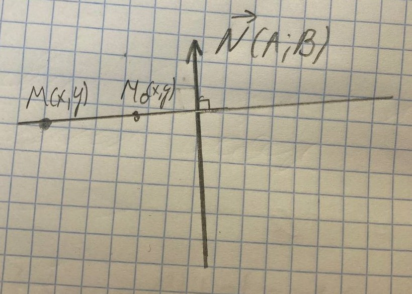  
- Возьмем точку с текущими координатами $M(x, y)$  
- Необходимое и достаточное условие принадлежности точки $M(x, y)$ указанной прямой есть равенство скалярного произведения $(\vec{N}, M_{0}M) = 0$. $\vec{N} = (A; B), M_{0}M = (x - x_{0}, y - y_{0})$.  
- Получим $A(x - x_{0}) + B(y - y_{0}) = 0$  

***Определение нормали***  
- Любой вектор, перпендикулярный прямой называется ее нормальным вектором или нормалью.  

### Общее уравнение прямой  
- Раскроем $A(x - x_{0}) + B(y - y_{0}) = 0$  
- $Ax + By  + \underbrace{- Ax_{0} - By_{0}}_{C} = 0$  
- $Ax + By + C= 0$  
### Неполные уравнения прямой  
- $C = 0$, $A \neq 0$, $B \neq 0 \implies Ax + By = 0 \implies y = -\dfrac{A}{B}x \implies y = kx$, $k$ - угловой коэффициент.  
- $C = 0$, $A = 0$, $B \neq 0 \implies By = 0 \implies y = 0$. Получим уравнение оси $Ox$.  
- $C = 0$, $A \neq 0$, $B = 0 \implies Ax = 0 \implies x = 0$. Получим уравнение оси $Oy$.  

***Определение координат нормали***  
- $(A; B)$ - координаты нормали  

### Уравнение прямой в отрезках на координатных осях  
- $Ax + By + C= 0$  
- $Ax + By = - C$ $| \cdot (- \dfrac{1}{C})$  
- $- \dfrac{A}{C}x - \dfrac{B}{C}y = 1$  
- $\dfrac{x}{\underbrace{-\dfrac{C}{A}}_{a}} + \dfrac{y}{\underbrace{-\dfrac{C}{B}}_{b}} = 1$  
- $\dfrac{x}{a} + \dfrac{y}{b} = 1$  

### Уравнение прямой с угловым коэффициентом  
- Пусть дан угол наклона прямой и оси $Ox$, направленной в положительную сторону. Тогда $\tan{\phi} = k$.   
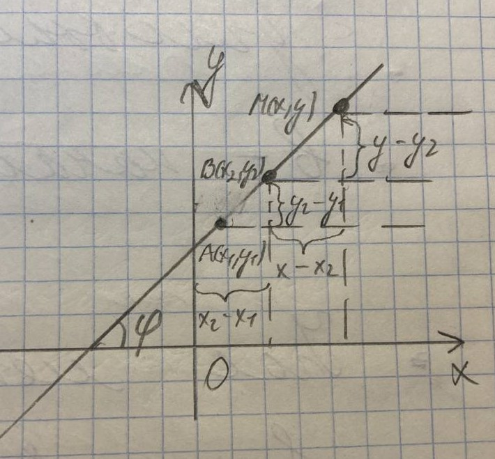  
- $\tan{\phi} = \dfrac{y_{2} - y_{1}}{x_{2} - x_{1}}$  
- $\tan{\phi} = \dfrac{y - y_{2}}{x - x_{2}}$  
- $\dfrac{y_{2} - y_{1}}{x_{2} - x_{1}} = \dfrac{y - y_{2}}{x - x_{2}}$  
- $y - y_{2} = \dfrac{y_{2} - y_{1}}{x_{2} - x_{1}}(x - x_{2})$. Получим уравнение прямой, проходящей, через две точки.  
- $y - y_{0} = \tan{\phi}(x - x_{0})$  
- $y - y_{0} = k(x - x_{0})$  
- $y = y_{2} + kx - kx_{2} = kx + y_{2} - kx_{2} = kx + b$. Получим уравнение прямой с угловым коэффициентом, где $b$ - начальная ордината.  

### Угол между двумя прямыми  
- Дано :  
- $\ell_{1} : y = k_{1}x + b_{1}$  
- $\ell_{2} : y = k_{2}x + b_{2}$    
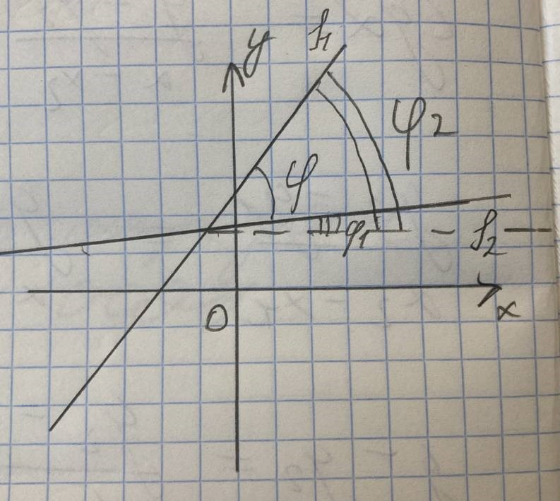   
- $\phi = \phi_{2} - \phi_{1}$  
- $\tan{\phi} = \tan{(\phi_{2} - \phi_{1})} = \dfrac{\tan{\phi_{2}} - \tan{\phi_{1}}}{1 + \tan{\phi_{1}\tan{\phi_{2}}}} = \dfrac{k_{2} - k_{1}}{1 + k_{1}k_{2}}$.  
- Заметим, $(1 + k_{1}k_{2} = 0) \implies \phi = \dfrac{\pi}{2} \implies \ell_{1} \perp \ell_{2}$  
- $(1 + k_{1}k_{2} = 0) \implies k_{1}k_{2} = -1 \implies k_{2} = -\dfrac{1}{k_{1}}$  

### Условие перпендикулярности, исходя из общего уравнения  
- Дано:   
- $\ell_{1} : A_{1}x + B_{1}y + C_{1}= 0$  
- $\ell_{2} : A_{2}x + B_{2}y + C_{2}= 0$  
- $(A_{1}; B_{1}) = \vec{N_{1}}$ - нормаль $\ell_{1}$  
- $(A_{2}; B_{2}) = \vec{N_{2}}$ - нормаль $\ell_{2}$  
- $(\vec{N_{1}}, \vec{N_{2}}) = 0$ - условие $\ell_{1} \perp \ell_{2}$  

***Определение угла между прямыми через нормали***  

- $\cos{\phi} = \dfrac{(\vec{N_{1}}, \vec{N_{2}})}{|\vec{N_{1}}|| \vec{N_{2}}|}$ - Угол между нормалями.  

### Каноническое уравнение прямой    

- Через точку $M_{0}(x_{0}, y_{0})$ проведем прямую, параллельную данному вектору $\vec{a} = (e, m)$. Этот вектор называется направляющим вектором прямой $\ell$.    
  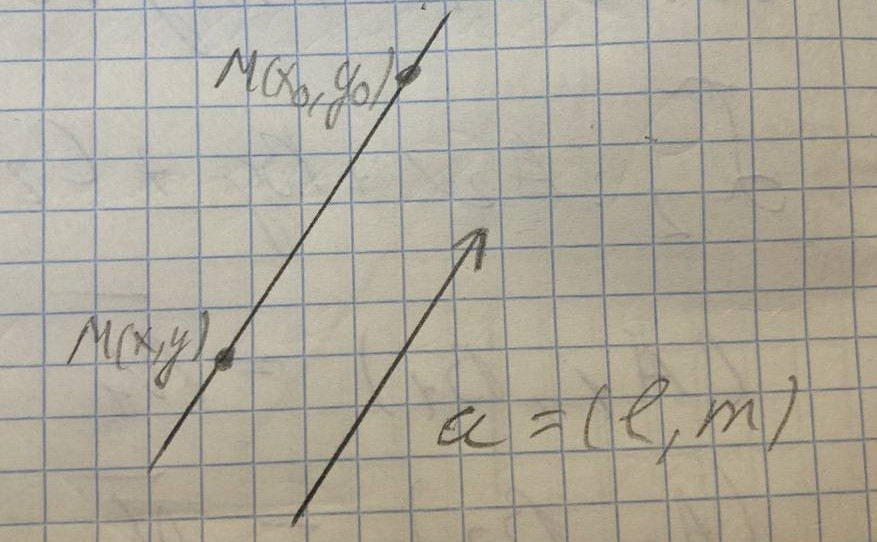   
  
- Условием принадлежности точки данной прямой является коллинеарность векторов $\vec{M_{0}M}$ и $\vec{a}$.  

***Каноническое уравнение прямой***  

- Так как коллинеарные векторы отличаются на константу, то $\vec{M_{0}M} = \lambda \vec{a}$:  
- $\begin{equation*}  
 \begin{cases}  
   x - x_{0}  = \lambda e\\  
   y - y_{0} = \lambda m  
  \end{cases}  
  \end{equation*} \implies$ $ \begin{equation*}  
   \begin{cases}  
    \lambda = \dfrac{x - x_{0}}{e} \\  
    \lambda = \dfrac{y - y_{0}}{m}  
   \end{cases}  
   \end{equation*} \implies \dfrac{x - x_{0}}{e} = \dfrac{y - y_{0}}{m}$  
### Параметрическое уравнение прямой  
- $ \dfrac{x - x_{0}}{e} = \dfrac{y - y_{0}}{m} = t$  
- $ \begin{equation*}  
   \begin{cases}  
    \dfrac{x - x_{0}}{e}  = t \\  
    \dfrac{y - y_{0}}{m} = t  
   \end{cases}  
   \end{equation*} \implies$ $\begin{equation*}  
   \begin{cases}  
    x  = x_{0} + t \\  
    y = y_{0} + t  
   \end{cases}  
   \end{equation*}$  
- $t$  можно трактовать, как время движения точки вдоль прямой.  

### Нормальное уравнение прямой   
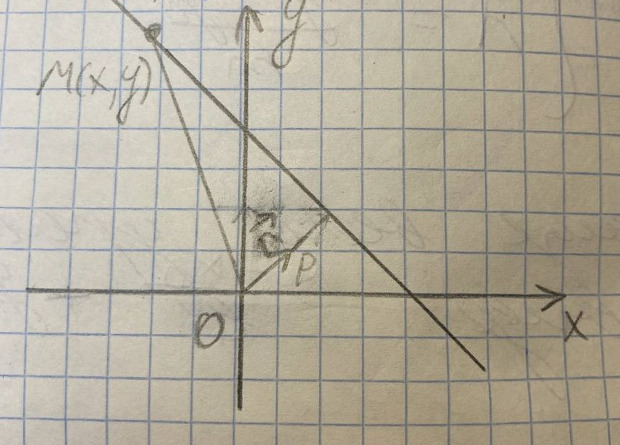  
- Необходимое и достаточное условие принадлежности точки данной: $pr_{\vec{n}(\vec{OM})} = p$ - это уже уравнение прямой. Выразим его в координатах.   
- $pr_{\vec{n}(\vec{OM})} = \dfrac{(\vec{OM}, \vec{n})}{|\vec{n}|} =(\vec{OM}, \vec{n}) = x\cos{\phi} + y\sin{\phi} = p \implies x\cos{\phi} + y\sin{\phi} - p = 0$  

***Нормальное уравнение прямой из ее общего уравнения***  
- $x\cos{\phi} + y\sin{\phi} - p = 0$  
- $Ax + By + C = 0$ $|(\cdot \dfrac{1}{\sqrt{A^2 + B^2}})$  
- $\dfrac{A}{\sqrt{A^2 + B^2}}x + \dfrac{B}{\sqrt{A^2 + B^2}}y + \dfrac{C}{\sqrt{A^2 + B^2}} = 0 \implies (\dfrac{A}{\sqrt{A^2 + B^2}})^2 + (\dfrac{B}{\sqrt{A^2 + B^2}})^{2} + (\dfrac{C}{\sqrt{A^2 + B^2}})^2 = 1$  

***Пример***  
1. $3x - 4y + 5 = 0$ $|\cdot (- \dfrac{1}{5}) \implies - \dfrac{3}{5}x + \dfrac{4}{5}y - 1 = 0$  

### Применение нормального уравнения прямой для нахождения расстояния от данной точки до данной прямой    
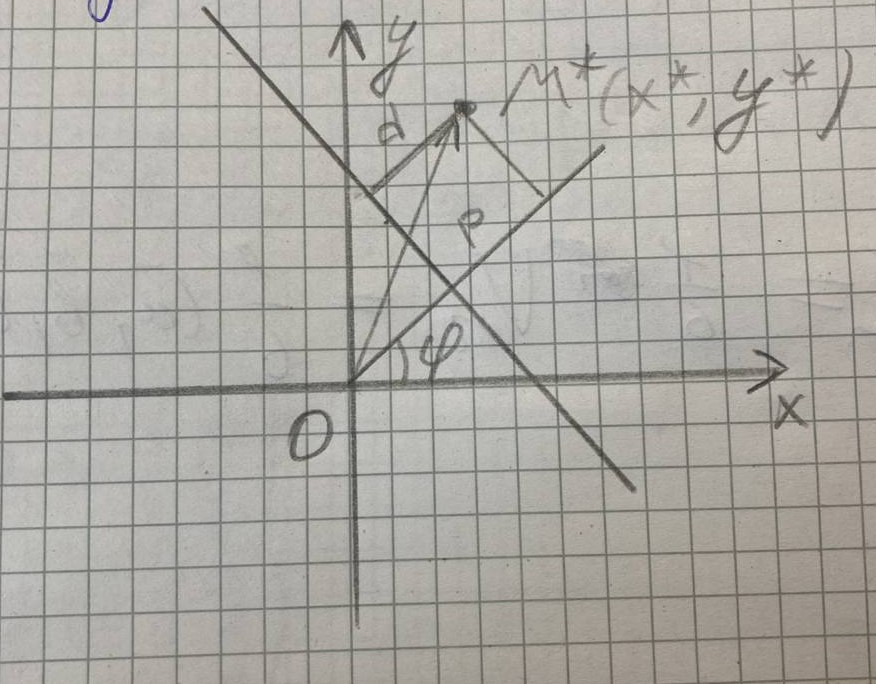  

- $pr_{\vec{n}}(\vec{OM}) = \dfrac{(\vec{OM}, \vec{n})}{|\vec{n}|} = x^{\star} \cos{\phi} + y^{\star} \sin{\phi}$  
- $d = x^{\star} \cos{\phi} + y^{\star} \sin{\phi} - p$. Это верно, если $M^{\star}$ и $O$ лежат по разные стороны от прямой   
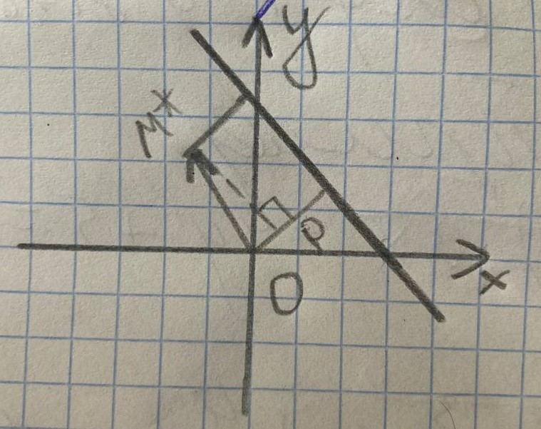   
- $pr_{\vec{n}}(\vec{OM}) = p - d$  

***Обозначение отклонения прямой от точки***  

- $x^{\star} \cos{\phi} + y^{\star} \sin{\phi} - p = \delta$. Где $\delta = \pm d$.  
- $\delta$ - отклонение точки от прямой  

***Задача***   

- Даны две пересекающиеся прямые $\ell_{1}, \ell_{2}$. Получить уравнение биссектрис углов между $\ell_{1}, \ell_{2}$.   
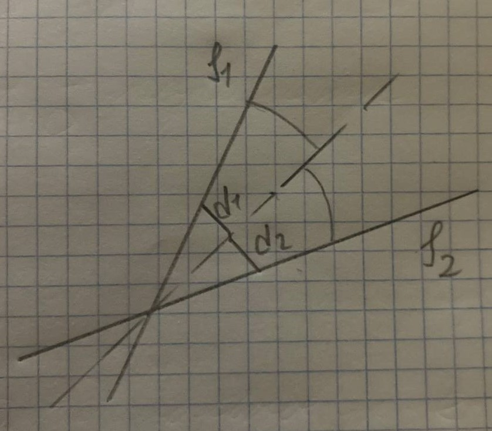   
- $d_{1} = x \cos{\phi_{1}} + y \sin{\phi_{1}} - p_{1}$  
- $d_{2} = x \cos{\phi_{2}} + y \sin{\phi_{2}} - p_{2}$  
- Расстояние до биссектрис $x \cos{\phi_{1}} + y \sin{\phi_{1}} - p_{1} = \pm (x \cos{\phi_{2}} + y \sin{\phi_{2}} - p_{2})$  

## Лекция 07.10.2022  

### Определение пучка прямых  

- Множество всех прямых, проходящих через данную точку называют пучком.  
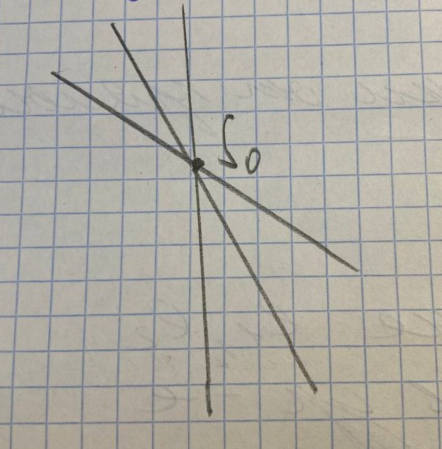  
- Эта точка либо задается непосредственно, либо как пересечение двух прямых пучка. Пусть это будут прямые:  $ \begin{equation*}  
   \begin{cases}  
    A_{1}x + B_{1}y + C_{1}  = 0 \\  
    A_{2}x + B_{2}y + C_{2}  = 0  
   \end{cases}  
   \end{equation*} \implies$ Пересечение, если $\begin{equation*}  
                \begin{vmatrix}   
                A_{1} & B_{1} \\  
                A_{2}  & B_{2}   
                \end{vmatrix}  
    				 \end{equation*} \neq 0$  

***Уравнение пучка***  

- $\alpha(A_{1}x + B_{1}y + C_{1}) + \beta(A_{2}x + B_{2}y + C_{2}) = 0$ ($\alpha , \beta$ - некоторые числа, $\alpha \neq 0, \beta \neq 0$ )  

***Пример***  

- Даны две пересекающиеся прямые, найти прямую, входящую в пучок первых двух и параллельную заданной прямой вне пучка.  
	- Данная прямая $\ell_{0} : A_{0}x + B_{0}y + C_{0}$  
	- $\ell_{1} : A_{1}x + B_{1}y + C_{1}$  
	- $\ell_{2} : A_{2}x + B_{2}y + C_{2}$  
	- Искомая прямая $\ell_{3} : A_{3}x + B_{3}y + C_{3}$  
	- Тогда $\alpha(A_{1}x + B_{1}y + C_{1}) + \beta(A_{2}x + B_{2}y + C_{2}) = 0$, найти $\alpha$ и $\beta$ такие, что полученная прямая параллельна $\ell_{0}$.  
	- Искомая прямая $\ell_{3}$ содержится в пучке. Пучок : $(\alpha A_{1} + \beta A_{2})x + (\alpha B_{1} + \beta B_{2})y + (\alpha C_{1} + \beta C_{2}) = 0 $. По условию задачи : $\dfrac{A_{3}}{A_{0}} = \dfrac{B_{3}}{B_{2}} \neq \dfrac{C_{3}}{C_{0}} \implies \dfrac{\alpha A_{1} + \beta B_{2}}{A_{0}} = \dfrac{\alpha B_{1} + \beta B_{2}}{B_{0}} \implies (\alpha A_{1} + \beta B_{2})B_{0} = (\alpha B_{1} + \beta B_{2})A_{0} \implies \alpha(A_{1}B_{0} - B_{1}A_{0}) = \beta(B_{2}A_{0} - A_{2}B_{0})$  
	- Пусть $\alpha \neq 0$, тогда $\beta = \dfrac{A_{1}B_{0} - B_{1}A_{0}}{B_{2}A_{0} - A_{2}B_{0}}$  

### Прямая и плоскость в пространстве  

### Уравнение плоскости  

- Составить уравнение плоскости через данную точку $M_{0}(x_{0}, y_{0}, z_{0})$, перпендикулярной данному вектору $\vec{N}(A, B, C)$  
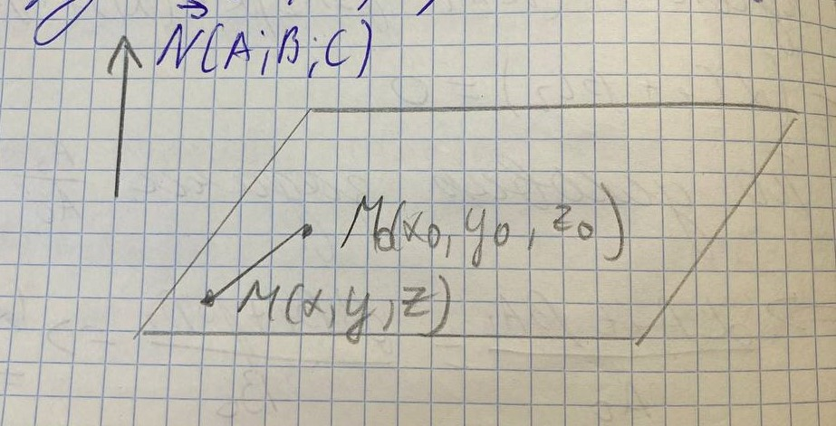   
- Необходимое и достаточное условие принадлежности $M(x, y, z)$ искомой плоскости: $(\vec{N}, \vec{M_{0}M}) = 0$, получим уравнение : $A(x - x_{0}) + B(y - y_{0}) + C(z - z_{0}) = 0$.  
- $Ax + By + Cz + D = 0$ ***(Общее уравнение плоскости, где $D = -Ax_{0} - By_{0} - Cz_{0}$)***  

### Неполные уравнения плоскости  
1. $D = 0 : Ax + By + Cz = 0$ (Плоскость, проходящая через начало координат)  
2. $A = 0: By + Cz + D= 0$ (Плоскость, параллельная $Ox$)  
3. $B = 0: Ax + Cz + D= 0$ (Плоскость, параллельная $Oy$)  
4. $C = 0: Ax + By + D= 0$ (Плоскость, параллельная $Oz$)  
4. $A = B = 0 : Cz + D = 0, z = - \dfrac{D}{C}, z = const$ (Плоскость, параллельная $Oxy$, $z = 0$ - уравнение $Oxy$)  

### Уравнение плоскости в отрезках на координатных осях  
- $Ax + By + Cz + D = 0 | \cdot (- \dfrac{1}{D})$  
- $\dfrac{Ax}{-D} + \dfrac{By}{-D} + \dfrac{Cz}{-D} = 1$. Обозначим $\dfrac{A}{-D} = a, \dfrac{B}{-D} = b, \dfrac{C}{-D} = c$  
- $ax + by + cz = 1$  
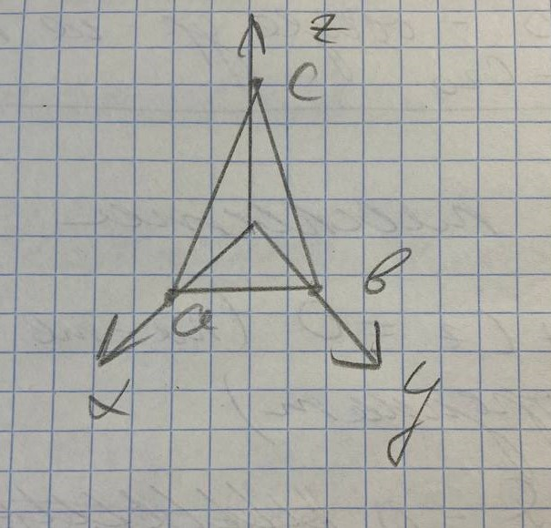  

### Угол между плоскостями. Условие параллельности и перпендикулярности двух плоскостей  

***Определение***  

- Угол между плоскостями есть угол между их нормалями.  
- $\cos\phi = \dfrac{(\vec{N_{1}}, \vec{N_{2}})}{|\vec{N_{1}}||\vec{N_{2}}|}$  
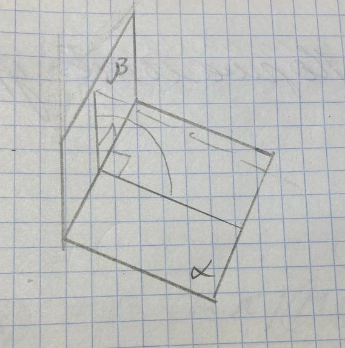  

***Условие параллельности двух плоскостей***  

- $\dfrac{A_{1}}{A_{2}} = \dfrac{B_{1}}{B_{2}} = \dfrac{C_{1}}{C_{2}}$  

***Условие перпендикулярности двух плоскостей***  

- $(\vec{N_{1}}, \vec{N_{2}}) = 0$  

### Нормальное уравнение плоскости  
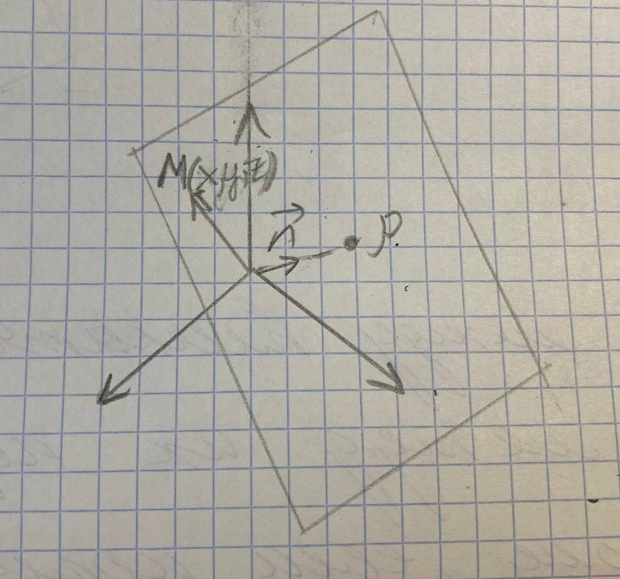  

- Плоскость задается $p, \alpha, \beta, \gamma$, где $p$ - расстояние от начала координат до плоскости и $\alpha, \beta, \gamma$ - углы $\vec{n}$ с осями координат.  
- Необходимое и достаточное условие принадлежности $M(x, y, z)$ искомой плоскости: $pr_{\vec{n}}{\vec{OM}} = p$  
- $\dfrac{(\vec{OM}, \vec{n})}{|\vec{n}|} = p \implies (\vec{OM}, \vec{n}) = p \ (|\vec{n}| = 1)$  
- $x\cos{\alpha} + y\cos{\beta} + z\cos{\gamma} = p$  
- $x\cos{\alpha} + y\cos{\beta} + z\cos{\gamma} - p = 0$ - Нормальное уравнение плоскости  

### Перевод из общего уравнение плоскости в нормальное  
- $Ax + By + Cz + D = 0 \ |\cdot (\dfrac{1}{\sqrt{A^{2} + B^{2} + C^{2}}}) $ (Если свободный член $< 0, $ то $| \cdot (- \dfrac{1}{\sqrt{A^{2} + B^{2} + C^{2}}})$  
- $\underbrace{\dfrac{A}{\sqrt{A^{2} + B^{2} + C^{2}}}}_{\cos{\alpha}}x + \underbrace{\dfrac{B}{\sqrt{A^{2} + B^{2} + C^{2}}}}_{\cos{\beta}}y +  \underbrace{\dfrac{C}{\sqrt{A^{2} + B^{2} + C^{2}}}}_{\cos{\beta}}z + \dfrac{D}{\sqrt{A^{2} + B^{2} + C^{2}}} = 0$  

### Расстояние от точки до плоскости  
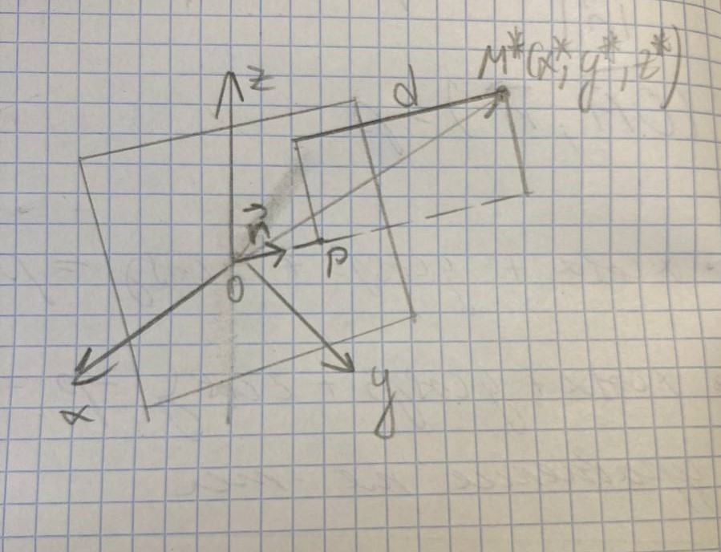  
- $d$ - расстояние от $M^{\star}$ до плоскости  
- $pr_{\vec{n}}(\vec{OM^{\star}}) = p + d$  
- $x^{\star}\cos{\alpha} + y^{\star}\cos{\beta} + z^{\star}\cos{\gamma} = p + d$  
- $x^{\star}\cos{\alpha} + y^{\star}\cos{\beta} + z^{\star}\cos{\gamma} - p = d$  

***Замечание***  

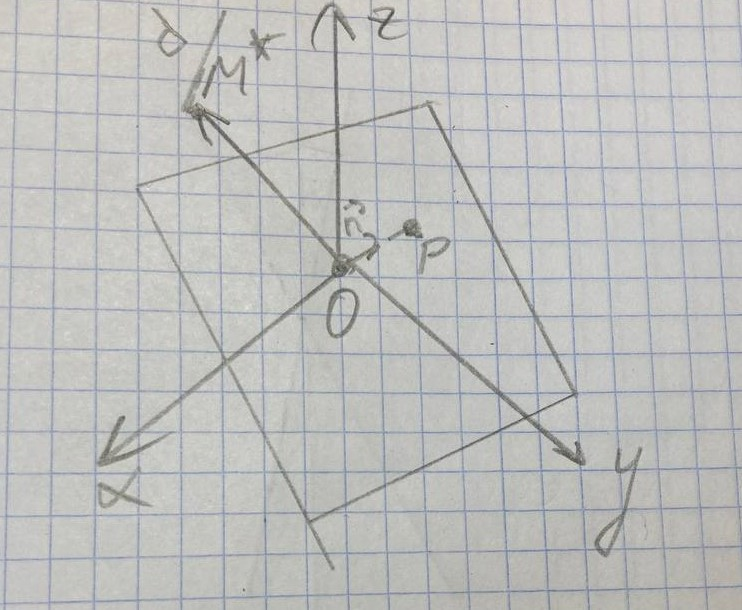  

- Если $\vec{OM^{\star}}$ по одну сторону от плоскости, то получим $x^{\star}\cos{\alpha} + y^{\star}\cos{\beta} + z^{\star}\cos{\gamma} - p = - d$  
- Отклонения $\delta$ точки от плоскости, $\delta = \pm d$. Причем, если $M^{\star}$ и $O$ лежат по разные стороны от плоскости, $\delta = d$. $\delta = - d$ иначе.  

### Уравнение биссектрисы плоскости двугранного угла  
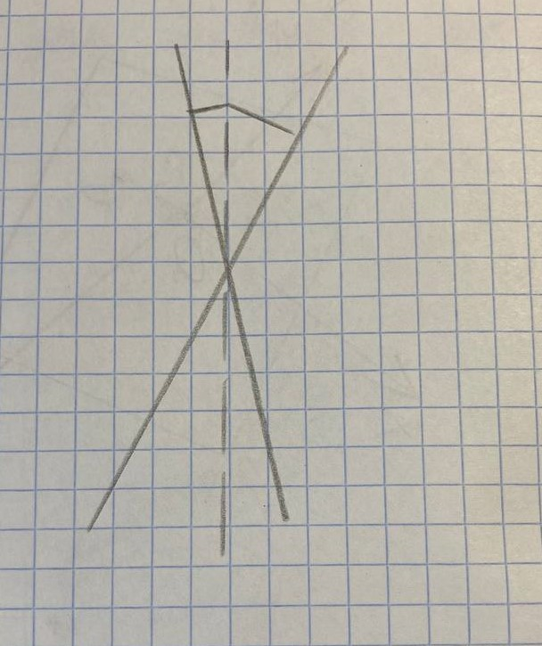  
- $x\cos{\alpha_{1}} + y\cos{\beta_{1}} + z\cos{\gamma_{1}} - p_{1} = x\cos{\alpha_{2}} + y\cos{\beta_{2}} + z\cos{\gamma_{2}} - p_{2}$  

## Лекция 21.10.2022 

### Пучек плоскостей

***Определение***
- Пучек плоскостей - множество всех плоскостей, проходящих через данную прямую.
 
- Пучек задается прямой, которая задается любой парой плоскостей.

***Общая формула пучка плоскостей***

- $\alpha(A_{1}x + B_{1}y + C_{1}z + D_{1}) + \beta(A_{2}x + B_{2}y + C_{2}z + D_{2}) = 0$. Где $\alpha, \ \beta$ - любые числа.

### Прямая в пространстве
- Прямая в пространстве может быть задана как система из двух уравнений плоскостей, пересечением которых она является.
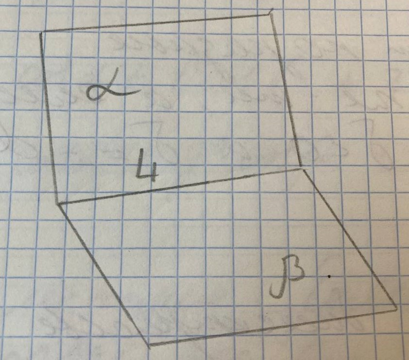 
- $\ell :  \begin{equation*} 
   \begin{cases} 
    A_{1}x + B_{1}y + C_{1}z + D_{1} = 0 \\  
    A_{2}x + B_{2}y + C_{2}z + D_{2} = 0  
   \end{cases}  
   \end{equation*}$
### Каноническое уравнение прямой в пространстве
- Рассмотрим задачу: через данную точку провести прямую, параллельную данному вектору.
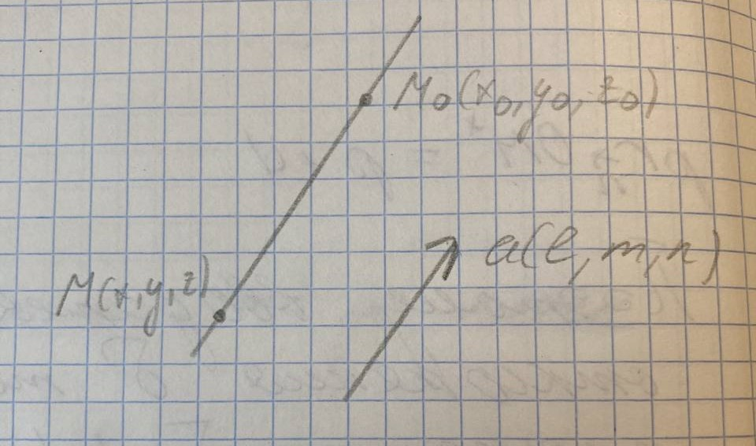 
- Необходимое и достаточное условие принадлежности искомой прямой является коллинеарность векторов $\vec{M_{0}M}$ и $a$. Это означает пропорциональность их соответствующих координат.
- $\dfrac{x - x_{0}}{l} = \dfrac{y - y_{0}}{m} = \dfrac{z - z_{0}}{n}$

### Переход от общих уравнений прямой к каноническому в пространстве

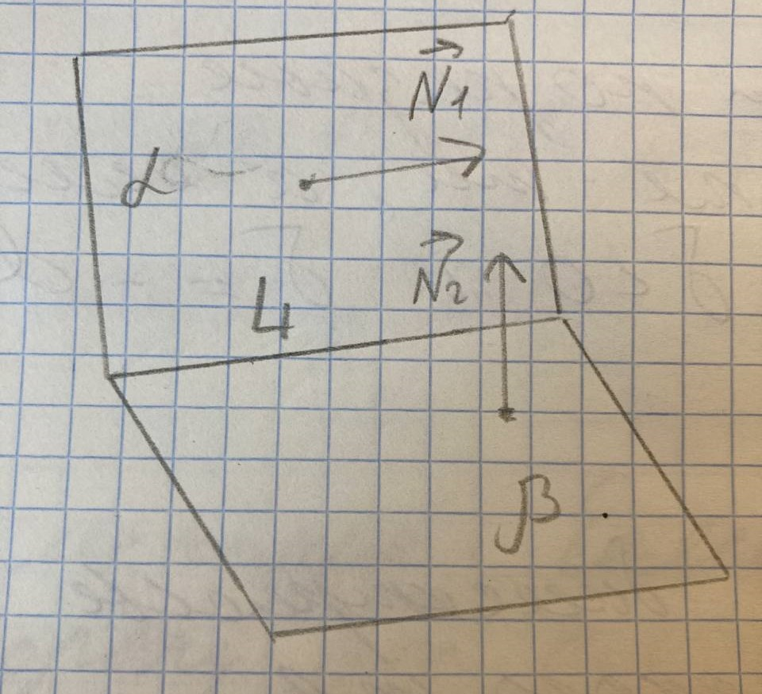 

- $\vec{a} = \left[\vec{N_{1}}, \vec{N_{2}}\right]$
- $\vec{N_{1}} = \left(A_{1}, B_{1}, C_{1} \right)$
- $\vec{N_{2}} = \left(A_{2}, B_{2}, C_{2} \right)$

***Пример***
- $\ell :  \begin{equation*} 
   \begin{cases} 
    x + y - z + 1 = 0 \\  
    2x - y + 3z - 2 = 0  
   \end{cases}  
   \end{equation*}$
- $\vec{N_{1}} = \left(1, 1, -1 \right)$
- $\vec{N_{2}} = \left(2, -1, 3 \right)$
-  $\vec{a} = \left[\vec{N_{1}}, \vec{N_{2}}\right] = \begin{equation*}  
                \begin{vmatrix}   
                i & j & k \\  
                1 & 1 & -1 \\
                2 & -1 & 3
                \end{vmatrix}  
                    				 \end{equation*} = \left(2, -5, -3 \right)$
- $z = 0 \implies \begin{equation*} 
   \begin{cases} 
    x + y = -1 \\  
    2x - y = 2  
   \end{cases}  
   \end{equation*} \implies x = \dfrac{1}{3}; y = - \dfrac{4}{3}$
- Искомое уравнение : $\dfrac{x - \dfrac{1}{3}}{2} = \dfrac{y + \dfrac{4}{3}}{-5} = \dfrac{z}{-3}$

### Угол между прямыми, условие параллельности и перпендикулярности прямых в пространстве.
- Даны две прямые :
- $\ell_{1} : \dfrac{x - x_{1}}{l_{1}} = \dfrac{y - y_{1}}{m_{1}} = \dfrac{z - z_{1}}{n_{1}}$
- $\ell_{2} : \dfrac{x - x_{2}}{l_{2}} = \dfrac{y - y_{2}}{m_{2}} = \dfrac{z - z_{2}}{n_{2}}$

***Определение угла между прямыми в пространстве***

- Углом между прямыми называют угол между их направляющими векторами $\vec{a_{1}}, \vec{a_{2}}$
- $\cos{\phi} = \dfrac{\left(\vec{a_{1}}, \vec{a_{2}} \right)}{|\vec{a_{1}}||\vec{a_{2}}|} $

***Условие перпендикулярности прямых в пространстве***
- $\left(\vec{a_{1}}, \vec{a_{2}} \right) = 0$

***Условие параллельности прямых в пространстве***

- Параллельность направляющих векторов.

### Построение прямой по двум точкам в пространстве
- Дано: $M_{1}(x_{1}, y_{1}, z_{1})$ , $M_{2}(x_{2}, y_{2}, z_{2})$
- $\vec{a} = (x_{2} - x_{1}, y_{2} - y_{1}, z_{2} - z_{1})$
- В качестве точки на прямой можно взять любую, например $M_{1}$
- $\ell : \dfrac{x - x_{1}}{x_{2} - x{1}} = \dfrac{y - y_{1}}{y_{2} - y_{1}} = \dfrac{z - z_{1}}{z_{2} - z_{1}}$

### Угол между прямой и плоскостью в пространстве
- Угол между $\vec{a}$ и нормалью отличается от угла между плоскостью и вектором $\vec{a}$ дополнением до $\dfrac{\pi}{2}$.
- Обозначим угол между $\vec{a}$ и плоскостью через $\phi$. Тогда угол между $\vec{N}$ и $\vec{a}$ будет $\dfrac{\pi}{2} - \phi$
- $\cos{\left(\dfrac{\pi}{2} - \phi\right)} = \dfrac{\left(\vec{N}, \vec{a}\right)}{|\vec{N}||\vec{a}|} = \sin{\phi}$. 

### Условие параллельности и перпендикулярности прямой и плоскости в пространстве

***Условие параллельности прямой и плоскости в пространстве***

- $\vec{N} \perp \vec{a} \implies \left(\vec{N}, \vec{a_{2}} \right) = 0$

***Условие перпендикулярности прямой и плоскости в пространстве***

- $\vec{N} \parallel \vec{a} \implies \dfrac{A}{l} = \dfrac{B}{m} = \dfrac{C}{n}$

### Условие принадлежности данной прямой данной плоскости
- $\ell : \dfrac{x - x_{0}}{l} = \dfrac{y - y_{0}}{m} = \dfrac{z - z_{0}}{n}$
- $\alpha : Ax + By + Cz + D = 0$
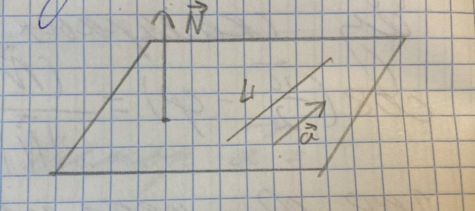 

***Условие принадлежности***
- $\left(\vec{N}, \vec{a}\right) = 0$ и $Al + Bm + Cn = 0$.
- Какая - то точка прямой должна принадлежать плоскости, например $(x_{0}, y_{0}, z_{0}) \implies Ax_{0} + By_{0} + Cz_{0} + D = 0$ 

### Параметрические уравнения прямой
- Пусть даны канонические уравнения прямой: $\dfrac{x - x_{0}}{l} = \dfrac{y - y_{0}}{m} = \dfrac{z - z_{0}}{n} = t$
- Имеем три уравнения с четырьмя переменными: $ \begin{equation*} 
   \begin{cases} 
    x - x_{0} = lt \\  
    y - y_{0} = mt \\
    z - z_{0} = nt
   \end{cases}  
   \end{equation*}$ $ \implies
   \begin{equation*} 
   \begin{cases} 
    x = x_{0} + lt \\  
    y = y_{0} + mt \\
    z = z_{0} + nt
   \end{cases}  
   \end{equation*}$
- С помощью этих параметрических уравнений легко находить точку пересечения прямой и плоскости: 
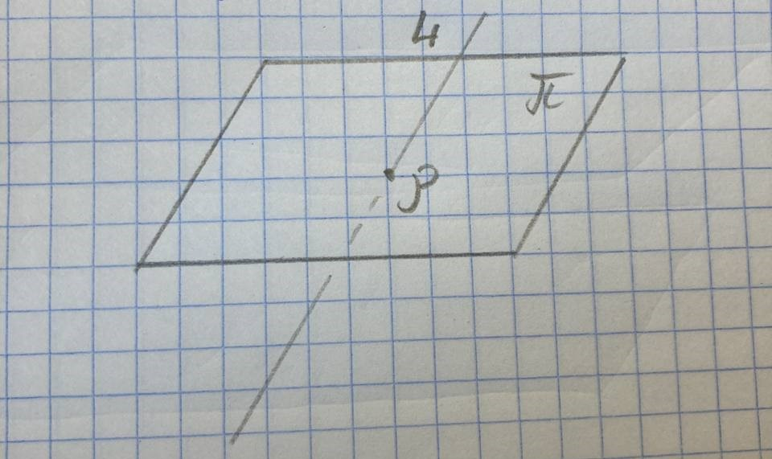 
- $\ell : \dfrac{x - x_{0}}{l} = \dfrac{y - y_{0}}{m} = \dfrac{z - z_{0}}{n} = t$
- $\pi : Ax + By + Cz + D = 0$
- Чтобы найти $\rho$ используем параметрические уравнения $\ell$ и подставим $x, y, z$ из этих уравнений в уравнение плоскости.
- $A(x_{0} + lt) + B(y_{0} + mt) + C(z_{0} + nt) + D = 0$. Получим одно уравнение с $t$.
- Находим $t$ и подставляем в параметрические уравнения. Это и будут координаты точек пересечения $\rho$.

***Примеры***
- Опустить $\perp$ из данной точки на данную плоскость.
	- Запишем канонические уравнения искомого перпендикуляра $\dfrac{x - x_{0}}{A} = \dfrac{y - y_{0}}{B} = \dfrac{z - z_{0}}{C}$

- Провести через данную точку плоскость, параллельную данной плоскости.
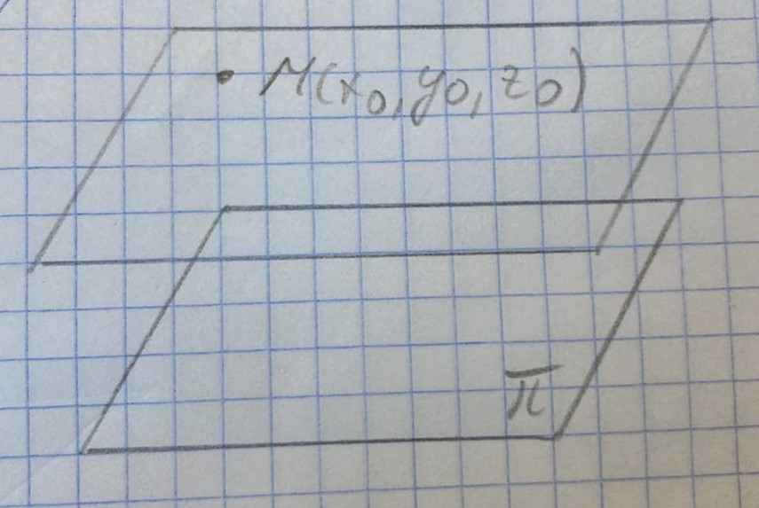 
- Дано : $\pi : Ax + By + Cz + D = 0$, $M_{0}(x_{0}, y_{0}, z_{0})$
- Нормаль искомой плоскости совпадает с нормалью данной плоскости $\vec{N} = (A, B ,C)$.
- Получим : $A(x - x_{0}) + B(y - y_{0}) + C(z - z_{0}) = 0$

### Условие принадлежности двух прямых плоскости в пространстве
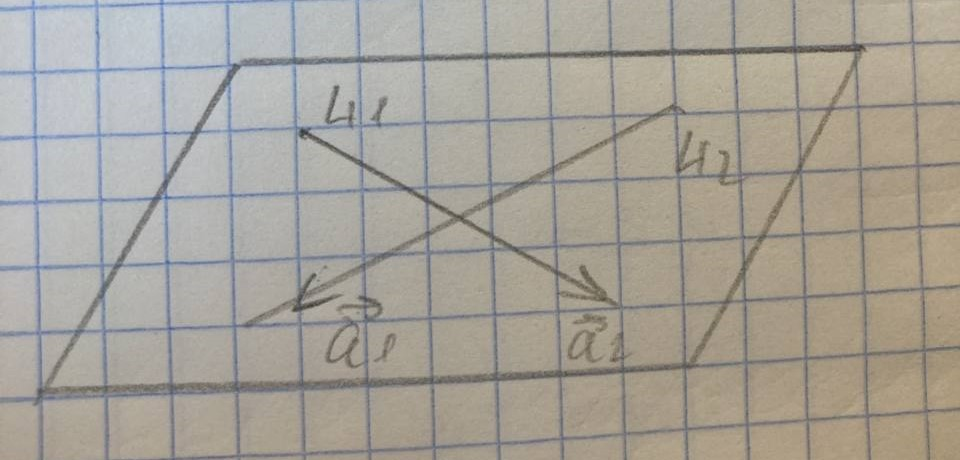 
- $\ell_{1} : \dfrac{x - x_{1}}{l_{1}} = \dfrac{y - y_{1}}{m_{1}} = \dfrac{z - z_{1}}{n_{1}}$
- $\ell_{2} : \dfrac{x - x_{2}}{l_{2}} = \dfrac{y - y_{2}}{m_{2}} = \dfrac{z - z_{2}}{n_{2}}$
- Воспользуемся условием компланарности трех векторов $(\vec{a_{1}}, \vec{a_{2}}, \vec{M_{1}M_{2}}) : \begin{vmatrix}   
x_{2} - x_{1} & y_{2} - y_{1} & z_{2} - z_{1} \\  
l_{1} & m_{1}  &n_{1} \\
l_{2} & m_{2}  &n_{2}
\end{vmatrix}   = 0$

### Скрещивающиеся прямые в пространстве
- Скрещивающиеся прямые лежат в параллельных плоскостях.
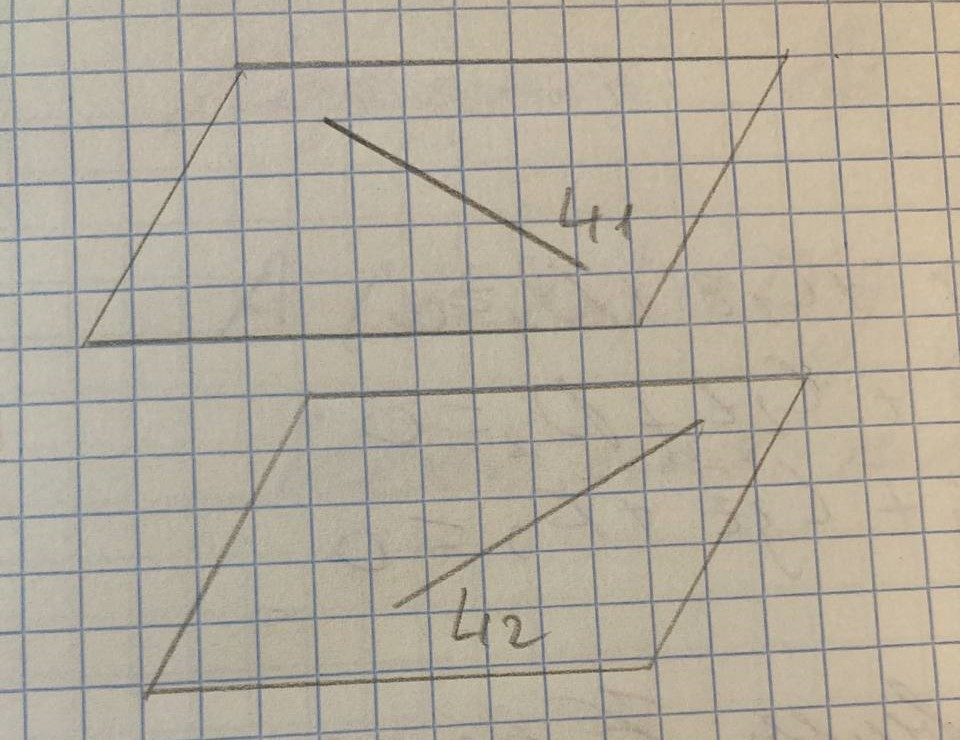 

***Пример***
- Написать уравнение плоскости, проходящей через одну из скрещивающихся прямых, параллельно другой из них.
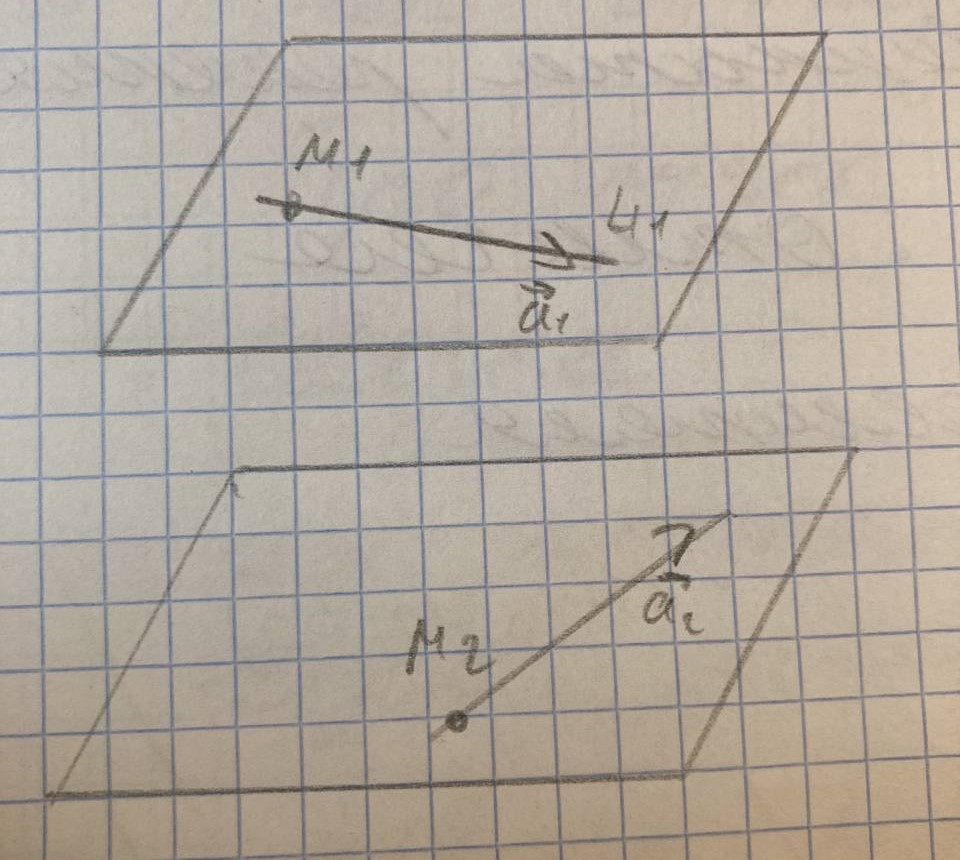 
- $\ell_{1} : \dfrac{x - x_{1}}{l_{1}} = \dfrac{y - y_{1}}{m_{1}} = \dfrac{z - z_{1}}{n_{1}}$
- $\ell_{2} : \dfrac{x - x_{2}}{l_{2}} = \dfrac{y - y_{2}}{m_{2}} = \dfrac{z - z_{2}}{n_{2}}$
- Для уравнения нужна нормаль $\vec{N} = [\vec{a_{1}}, \vec{a_{2}}] = (A, B, C) $ и точка $M(x_{1}, y_{1}, z_{1})$.
- Искомая плоскость : $A(x - x_{1}) + B(y - y_{1}) + C(z - z_{1}) = 0$ 

### Пучек и связка плоскостей

***Определение связки плоскостей***
- Связка плоскостей - совокупность всех плоскостей, проходящих через данную точку.
- Дана точка $M_{0}(x_{0},y_{0}, z_{0})$. Уравнение связки плоскостей : $A(x - x_{0}) + B(y - y_{0}) + C(z - z_{0}) = 0$. Где $A, B, C$ - произвольные числа, не равные нулю одновременно.

### Условие прохождения трех различных плоскостей через одну и только одну точку.
- Дано: $ \begin{equation*} 
   \begin{cases} 
    A_{1}x + B_{1}y + C_{1}z + D_{1} = 0 \\  
    A_{2}x + B_{2}y + C_{2}z + D_{2} = 0 \\
    A_{3}x + B_{3}y + C_{3}z + D_{3} = 0
   \end{cases}  
   \end{equation*}$
- По правилу Крамера условие единственности решения системы : $\begin{equation*}  
                \begin{vmatrix}   
                A_{1} & B_{1} & C_{1} \\  
                A_{2} & B_{2} & C_{2} \\
                A_{3} & B_{3} & C_{3}
                \end{vmatrix}  
                    				 \end{equation*} = 0$
## Лекция 18.11.2022 
### Прямая в пространстве
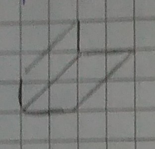 
- $ \begin{equation*} 
   \begin{cases} 
    A_{1}x + B_{1}y + C_{1}z + D_{1} = 0 \\  
    A_{2}x + B_{2}y + C_{2}z + D_{2} = 0 \\
   \end{cases}  
   \end{equation*}$ - Общее уравнение прямой, можно описать эту же прямую любой другой парой плоскостей пучка.
- Общий вид плоскостей пучка: $\alpha(A_{1}x + B_{1}y + C_{1}z + D_{1}) + \beta(A_{2}x + B_{2}y + C_{2}z + D_{2}) = 0$ 
### Некоторые задачи на прямую и плоскость
- Условие пересечения трех различных плоскостей в одной и только одной точке
	- $ \begin{equation*} 
   \begin{cases} 
    A_{1}x + B_{1}y + C_{1}z + D_{1} = 0 \\  
    A_{2}x + B_{2}y + C_{2}z + D_{2} = 0 \\
    A_{2}x + B_{2}y + C_{2}z + D_{3} = 0
    \end{cases}  
    \end{equation*}$ 
	-  По правилу Крамера система имеет единственное решение когда определитель системы отличен от нуля
  - $\Delta = \begin{equation*} \begin{vmatrix}   
                A_{1} & B_{1} & C_{1} \\  
                A_{2} & B_{2} & C_{2} \\
                A_{3} & B_{3} & C_{3}
                \end{vmatrix}  
                \end{equation*} \neq 0$
- Даны две плоскости. Нписать уравнения биссекторных плоскостей.
	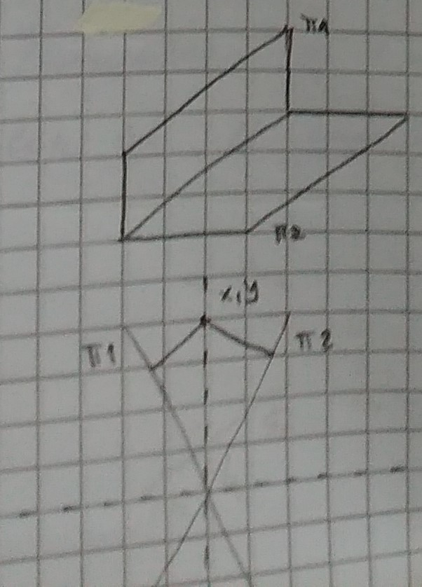
	- Приведем каждое из уравнений плоскостей к нормальному виду
	- $x\cos{\alpha} + y\cos{\beta} + z\cos{\gamma} - p = 0$
	- $\alpha, \beta, \gamma$ - углы нормального вектора плоскости с осями координат.
	- $p$ - расстояние от начала координат до плоскости
	- Переход от общего уравнения плоскости к нормальному:
	- $Ax + By + Cz + D = 0 \bigg| \cdot \left(\pm \dfrac{1}{\sqrt{A^{2} + B^{2} + C^{2}}}\right)$
	- $\dfrac{A}{\sqrt{A^{2} + B^{2} + C^{2}}}x + \dfrac{B}{\sqrt{A^{2} + B^{2} + C^{2}}}y + \dfrac{C}{\sqrt{A^{2} + B^{2} + C^{2}}}z - \dfrac{|D|}{\sqrt{A^{2} + B^{2} + C^{2}}} = 0$
	- Уравнение биссекторных плоскостей:
	- $x\cos{\alpha_{1}} + y\cos{\beta_{1}} + z\cos{\gamma_{1}} - p_{1} = \pm \left(x\cos{\alpha_{2}} + y\cos{\beta_{2}} + z\cos{\gamma_{2}} - p_{2}\right)$ 
	- Условие пересечения данной плоскости отрезка $AB$
	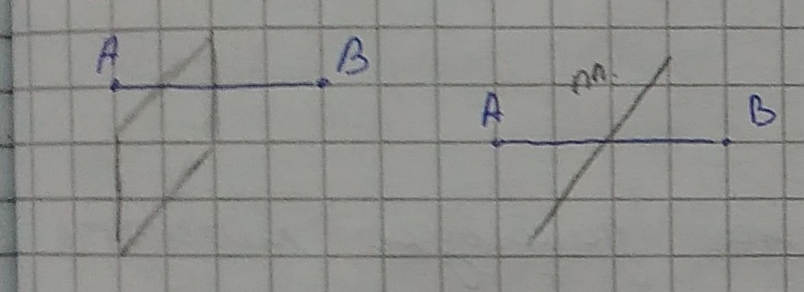
	- Запишем плоскость в нормальном виде
	- Найдем отклонения точки $A$ и $B$ от плоскости $\delta_{A}, \delta_{B}$
	- Условие пересечения: знаки $\delta_{A}$ и $\delta_{B}$ - разные
- Даны две точки $A$ и $B$. Выяснить лежат ли эти точки:
	- В одном углу между двумя плоскостями
	  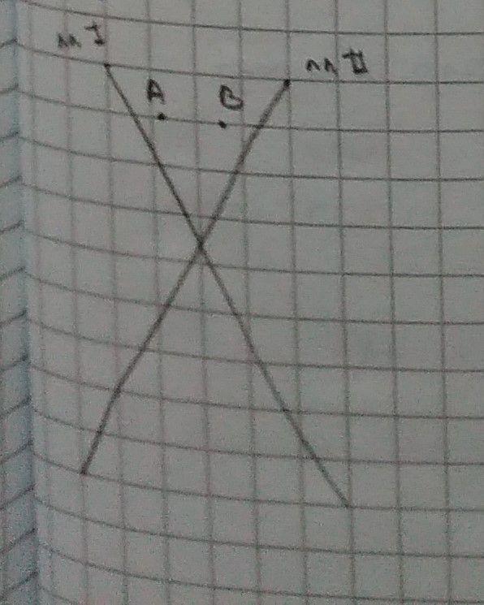
	  - Вычислим отклонения этих точек от обеих плоскостей:
	  - $\delta_{A}^{1},\ \delta : \ \delta_{A}^{1}, \ \delta_{B}^{1}$ - один знак
	  - $\delta,\ \delta_{B}^{2} : \ \delta_{A}^{2}, \ \delta_{B}^{2}$ - один знак
	- В смежных углах
		- 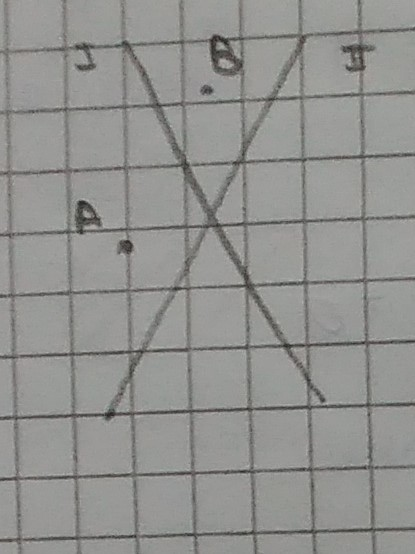
		- Знаки отклонения точек $A$ и $B$ от первой плоскости - разные, от второй - одинаковые
	- В вертикальных углах
		- 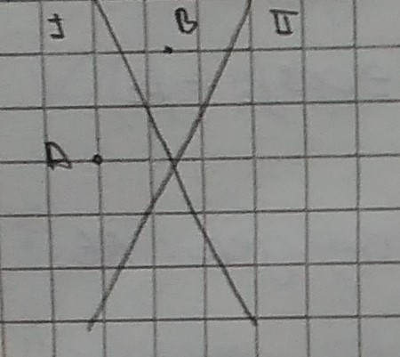
		- Отклонения $A$ и $B$ от первой плоскости - разные, от второй - разные.
- Опустить $\perp$ из данной точки на данную плоскость
	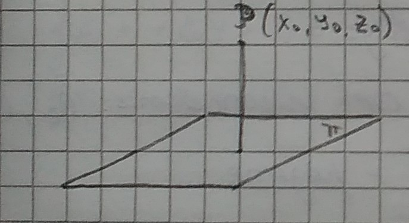
	- Уравнение плоскости : $Ax + By + Cz + D = 0$
	- $A,\ B, \ C$ - координаты нормали вектора $\vec{N}(A,B,C)$
	- Известны координаты направлений вектора - перпендикуляра, каноническое уравнение:
	- $\dfrac{x - x_{0}}{l} = \dfrac{y -y_{0}}{m} = \dfrac{z - z_{0}}{n}$
	- $\vec{a} = (l, m, n)$ - направляющий вектор
	- $\dfrac{x - x_{0}}{A} = \dfrac{y - y_{0}}{B} = \dfrac{z - z_{0}}{C}$
- Через данную прямую провести плоскость $\perp$ данной плоскости
	- $L : \dfrac{x - x_{0}}{l} = \dfrac{y - y_{0}}{m} = \dfrac{z - z_{0}}{n}$
	- Точка искомой плоскости: $M_{0}\left(x_{0}, y_{0}, z_{0}\right)$
	- Вектор нормали : $\vec{N} = \left[\vec{N_{0}}, \vec{a}\right]$
	- Векторы данной плоскости $\vec{N_{0}} = \left(A,B,C\right)$
	- $A(x - x_{0}) + B(y - y_{0}) + C(z - z_{0}) = 0$
- Через данную прямую провести плоскость $\parallel$ данной плоскости
	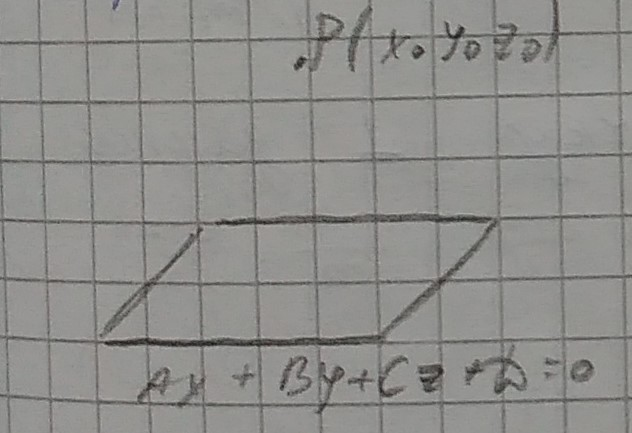
	- Точка искомой плоскости известна: $P(x_{0}, y_{0}, z_{0})$
	- $\vec{N}$ - нормальный вектор совпадает с нормальным вектором данной плоскости $\vec{N} = (A, B, C)$
	- $A(x - x_{0}) + B(y - y_{0}) + C(z - z_{0}) = 0$
- Условие принадлежности двух прямых данной плоскости
	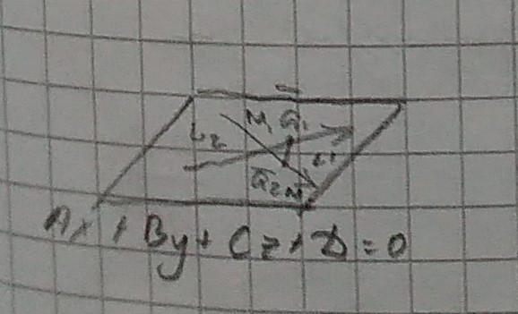
	- $L_{1} : \dfrac{x - x_{1}}{l_{1}} = \dfrac{y - y_{1}}{m_{1}} = \dfrac{z - z_{1}}{n_{1}}$
	- $L_{2} : \dfrac{x - x_{2}}{l_{2}} = \dfrac{y - y_{2}}{m_{2}} = \dfrac{z - z_{2}}{n_{1}}$
	- Условие принадлежности двух прямых - компланарность векторов $\vec{a_{1}}, \ \vec{a_{2}}$ и $\vec{M_{1}}, \ \vec{M_{2}}$, то есть смешанное произведение равно $0$:
	- $\begin{equation*} \begin{vmatrix}   
	      x_{2} - x_{1} & y_{2} - y_{1} & z_{2} - z_{1} \\  
	      l_{1} & m_{1} & n_{1} \\
	      l_{2} & m_{2} & n_{2} 
	      \end{vmatrix} 
	      \end{equation*} = 0$
- Даны две прямые $L_{1}, \ L_{2}$. Провести через $L_{1}$ плоскость $\parallel$ $L_{2}$
	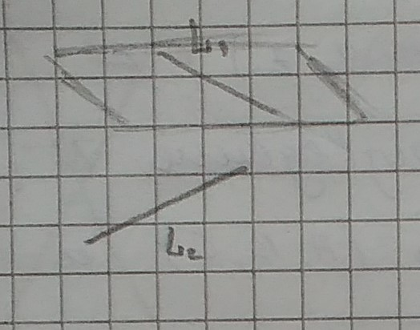
	 - $L_{1} : \dfrac{x - x_{1}}{l_{1}} = \dfrac{y - y_{1}}{m_{1}} = \dfrac{z - z_{1}}{n_{1}}$
	 - $L_{2} : \dfrac{x - x_{2}}{l_{2}} = \dfrac{y - y_{2}}{m_{2}} = \dfrac{z - z_{2}}{n_{2}}$
	 - Для наклонной плоскости нужны точка $M_{0}\left(x_{1}, y_{1}, z_{1}\right)$ и вектор нормали $\vec{N} = \left[\vec{a_{1}}, \vec{a_{2}}\right] = \begin{equation*} \begin{vmatrix}   
	      \vec{i} & \vec{j} & \vec{k} \\  
	      l_{1} & m_{1} & n_{1} \\
	      l_{2} & m_{2} & n_{2} 
	      \end{vmatrix} 
	      \end{equation*}$
- Провести плоскость через даннуб точку $\perp$ данной прямой
	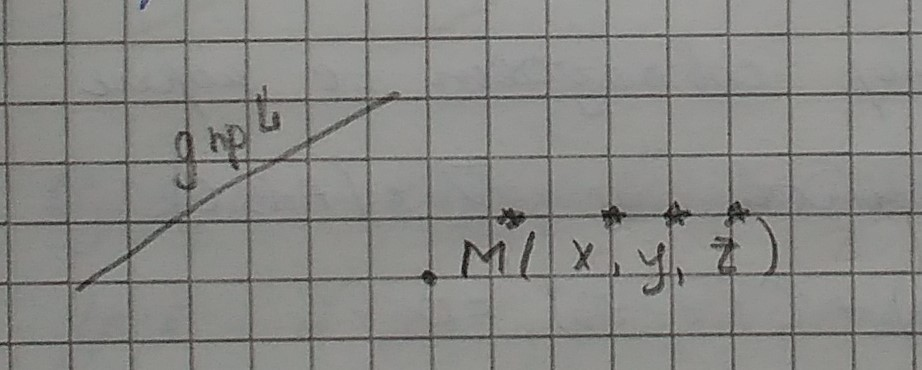
	- $L_{1} : \dfrac{x - x_{0}}{l} = \dfrac{y - y_{0}}{m} = \dfrac{z - z_{0}}{n} $
	- Искомое уравнение $l\left(x - x^{\star}\right) + m\left(y - y^{\star}\right) + n\left(z - z^{\star}\right) = 0$
- Провести плоскость через данную прямую и не принадлежащую ей точку
	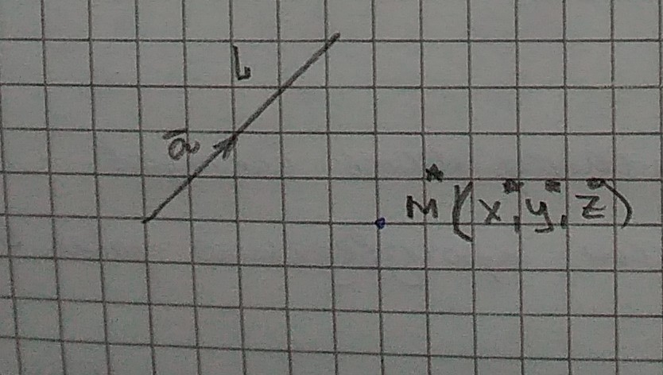
	- $L : \dfrac{x - x_{0}}{l} = \dfrac{y - y_{0}}{m} = \dfrac{z - z_{0}}{n} $
	- Точка искомой плоскости: $M^{\star}$. Нормальный вектор искомой плоскости: $\vec{N} = \left[\vec{a}, \vec{M_{0}M^{\star}}\right]$
- Через данную точку провести $\perp$ к заданной прямой 
	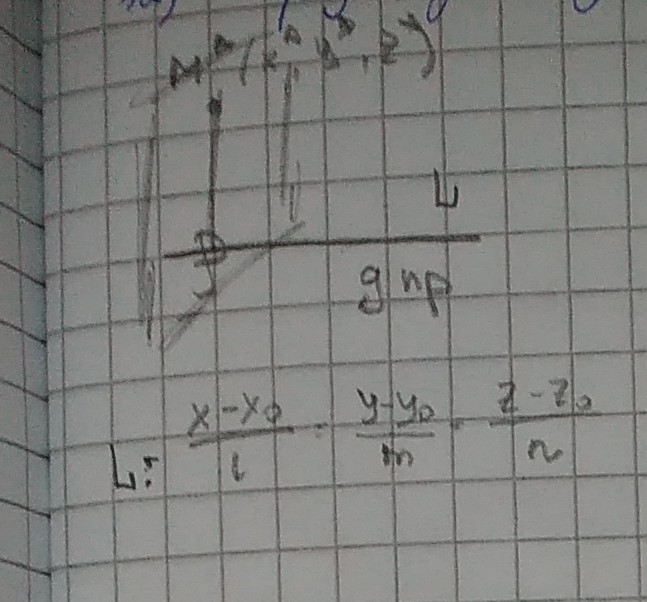
	- Можно свести к предыдущей задаче
	- Провести через $M^{\star}$ плоскость $\perp$ $L$.
	- Найти $m \times p$ и получить направляющий вектор искомого перпендикуляра: $\vec{a} = \vec{pM}$
- Написать уравнение общего перпендикуляра двум скрещивающимся прямым
	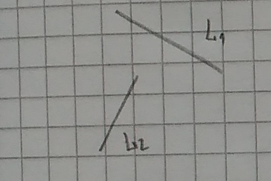
	- Направляющий вектор $\vec{a} = \left[\vec{a_{1}}, \vec{a_{2}}\right]$. $m$ - любая из $L_{1}$ и $L_{2}$
- Найти расстояние между скрещивающимися прямыми
	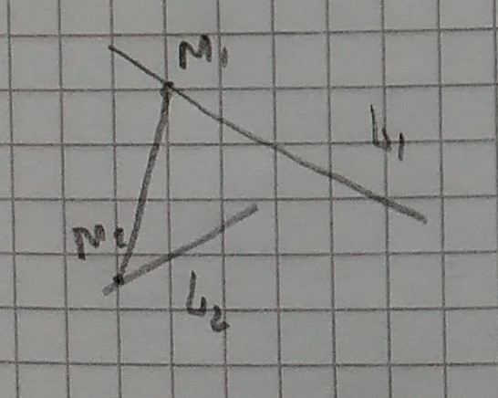
	- Искомое расстояние $d$ - проекция вектора $\vec{M_{1}M_{2}}$ на общий $\perp$
	- $pr_{b}(\vec{a}) = \dfrac{\left(\vec{a}, \vec{b}\right)}{|b|}$
	- $\vec{N}_{\perp} = \left[\vec{a_{1}},\vec{a_{2}} \right]$
	- $d = \dfrac{\left(\left[\vec{a_{1}}, \vec{a_{2}}\right], \vec{M_{1}M_{2}}\right)}{\left|\left[\vec{a_{1}}, \vec{a_{2}}\right]\right|}$